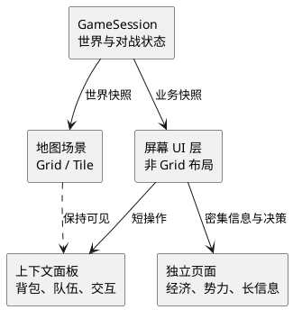

# Agent 与活世界：战略访谈记录

> 状态：本轮访谈结束；结论已进入提案  
> 最后整理：2026-07-16  
> 记录用途：保留产品与领域探索过程，供后续访谈继续追加。它不是架构决策、领域模型或实现计划。

本记录讨论 Agent 如何参与活世界。世界的顶层公平、经济、势力和长线战略见[宏观战略版：设定总纲与核心架构](002-macro-strategy-outline.md)。本轮 UI 结论已整理为[Flex UI 布局与 GPU 渲染改造方案](../006-proposals/001-flex-ui-layout-and-rendering.md)。

## 记录规则

- 本文只记录已经表达的意图、明确否定过的方向和仍待讨论的问题。
- `暂定` 表示当前思路，不应据此直接修改 crate、接口或数据结构。
- 尚未被用户确认的归纳，会明确标成“理解”，不伪装成结论。
- 后续讨论优先补充本文；等产品身份和边界足够清楚后，再把已确认内容迁入决策文档。

## 当前访谈范围

当前目标是把宏观战略转化为代码仓库中的系统边界、数据模型、规则引擎、Agent 运行方式和迭代顺序。

不默认展开人物背景、阵营归属、具体剧情和任务细节。只有它们会直接改变上述系统约束时，才把它们作为讨论输入。

## 当前意图

### 终态愿景

项目终态不是单纯复刻一套宝可梦规则，也不只是给游戏加一个聊天模型。

用户当前的描述是：

- 它是一个以 Agent 为中心、对大模型友好的平台。
- 它是一款“活的游戏”。
- 大世界并非完全由固定脚本推进。
- 主线大纲仍由人工预先设计；世界细节、支线和角色行为可以在受控范围内变化。

这仍是愿景表述。它尚未确定产品形态、单机或联网边界、模型部署方式，以及玩家是否直接感知到 Agent 的存在。

### 近期目标

近期优先级已经明确为：

1. 把大世界搭出来。
2. 让对战基本可用且稳定。
3. 跑通 AI 对战。

实现优先级不是并行的：**稳定对战 > 大世界 > AI 对战**。

对战是先要可靠的规则核心。大世界随后建立。AI 对战最后接入，并消费前两者已经稳定的能力。

当前尚未把每一阶段拆成验收指标、crate 改造任务或排期。

### 当前阶段：大世界 UI 优先

用户认为当前对战已有一定基础，接下来应先建设大世界。

大世界的核心入口是 UI。现有地图 UI 可以继续作为可用基础；其他页面的 UI 架构不适合继续沿用，因为它们被强行塞进 Grid。

2026-07-16 的源码检查显示，这个判断对应一个真实的展示层边界问题：

- `game-view` 用 Grid 坐标表示文本、图片边界和背景 Surface。
- `game-native-plan::FramePlan::from_game_view` 要求所有带 Surface 的图层共享同一 Grid 尺寸，然后提交给 GPU。
- `game-ui` 已经单独拥有交互和展示状态，但图鉴、对战菜单等页面最终仍被投影进这套统一 Grid 表示。

地图和角色移动本身适合保留 Grid。问题是把非地图页面也视为同一类格子画布。大世界阶段应先建立能同时容纳地图场景和常规 UI 页面的展示边界，而不是继续在固定 Grid 上堆叠页面。

这里尚未决定新的 UI 工具、渲染后端、crate 名称或迁移方式。

### 已同意的 UI 交互模型

采用混合模型，不把所有非地图 UI 强行做成覆盖层，也不把所有操作都切换到独立页面。

| 内容 | 默认呈现方式 | 原因 |
| --- | --- | --- |
| 背包、队伍 | 覆盖地图的上下文面板 | 高频、短操作。保留地点和探索上下文。 |
| 经济、势力 | 独立页面 | 需要阅读价格、地区差异、关系、趋势和决策。 |
| 对话、任务、现场交互 | 轻量覆盖层 | 保持在世界中的连续感。长篇信息或关键选择可以进入独立页面。 |

地图继续是 Grid 场景。非地图 UI 使用独立的屏幕坐标布局层，不再由同一张 Grid Surface 决定尺寸和位置。

世界状态持续存在。打开面板或进入独立页面只改变展示层级和输入焦点，不等同于销毁、替换或暂停大世界状态。



这只确定展示职责。输入路由、动画、页面导航、组件系统、渲染 API 和 crate 拆分仍待在大世界 UI 工作中设计。

### Flex UI 技术提案

> 状态：正在讨论的技术方向，尚未创建 crate 或修改现有渲染 API。

用户提出：新建一个 package，支持在 GPU 上绘制 Flexbox 子集布局的 UI。

这个方向适合解决非地图 UI 被 Grid 约束的问题，但需要区分两个职责：

- Flex 布局在 CPU 上计算。它应是纯逻辑，能对固定输入稳定地产生矩形结果并独立测试。
- GPU 负责绘制矩形、图片、文字和裁剪后的结果。它不负责求解 Flex 规则。

当前 `punctum-gpu` 也还没有像素 UI 的提交模型：`GpuImage` 使用 `GridRect`，`plan_composite` 要求 `Surface`，提交实例也是格子位置和跨度。因此只增加一个 Flex crate 不够；GPU 计划层也必须增加像素矩形的绘制路径。

推荐的目标边界如下：

```text
punctum-ui（新 foundation crate，候选名称）
|
|- UI Tree：节点、样式、内容、稳定 UiId
|- Flex 子集：纯布局计算，不依赖窗口或 wgpu
|- Layout Frame：每个节点的像素矩形、层级、裁剪和命中区域
`- Draw List：填充、图片、文字、裁剪指令
             |
             v
punctum-gpu（扩展现有 crate）
|
`- Pixel Quad / Pixel Clip / 像素坐标 SubmissionPlan
             |
             v
game-native-plan 与 GPU adapter
`- 在同一帧组合地图 Grid 计划和 UI 像素计划
```

新 crate 不直接依赖 `wgpu`、窗口或输入设备。它可以依赖纯数据类型，并把文字测量作为明确传入的能力。真正提交 GPU 的适配由现有 `punctum-gpu` 和 native adapter 处理。

#### 第一版 Flex 子集

第一版只做支撑游戏 UI 的部分：

- 容器方向：`row`、`column`、叠放。
- 尺寸：固定像素、填满剩余空间、最小值和最大值。
- 间距：内边距、外边距、`gap`。
- 对齐：主轴起点、居中、末端、均匀分布；交叉轴起点、居中、末端、拉伸。
- 覆盖：绝对定位子节点，用于地图上的 HUD、弹窗和遮罩。
- 裁剪：矩形裁剪，后续支持滚动区域。
- 命中：由布局结果导出的稳定点击/焦点区域。

第一版不追求 CSS 兼容：不做选择器、层叠、复杂百分比规则、自动换行、负边距、基线排版或浏览器式布局兼容性。

#### 验证与迁移顺序

1. 在 `punctum-gpu` 增加独立于 Grid 的像素矩形提交能力。
2. 新建 `punctum-ui`，用 fixture 测试 Flex 结果、裁剪和命中区域，不启动 GPU。
3. 用现有图鉴或一个专注页面作为首个验证对象，不同时迁移地图和战斗。
4. 让 `game-native-plan` 合成地图 Grid 计划与 UI 像素计划。
5. 再迁移背包、队伍、情报、经济和势力页面。

是否保留旧 Grid 页面、迁移过程中两个渲染模型如何共存，以及文字渲染 API 的具体形态，仍需在开始实现前确定。

### 页面堆栈草案

> 状态：推荐方案，待确认。它描述页面之间的关系，不代表已经存在或承诺实现所有页面。

页面不应形成任意嵌套的弹窗链。世界探索时的最大结构是：地图场景、一个可选上下文面板或专注页面，以及一个可选确认弹窗。

```text
GameSession（业务状态，不是页面）
|
+-- World Scene
|   |
|   +-- L0  地图场景：地块、角色、可交互物、世界变化
|   +-- L1  情境信息：同行伙伴状态、短暂地区提示、重要通知标记
|   +-- L2  短交互层：对话、现场交互、商店入口、短提示
|   +-- L3  上下文面板：背包、队伍摘要、快速线索
|   +-- L4  专注页面：队伍详情、培育、经济、势力、情报、图鉴
|   `-- L5  确认弹窗：交易确认、关键选择、退出确认
|
`-- Battle Scene（排他场景，不与 World Scene 页面叠加）
    `-- 战斗 HUD 与战斗菜单
```

`L0` 到 `L3` 可以同时存在。`L4` 一次只能打开一个，并取代当前的上下文面板。`L5` 只覆盖当前活动页面或面板。关闭 `L5` 回到原处；关闭 `L4` 或 `L3` 回到地图。

战斗不是从地图上再叠一张大页面。它是 `GameSession` 的独立场景。战斗结束后，业务状态返回世界场景，UI 再恢复到地图上下文。

#### 地图默认画面

```text
+----------------------------------------------------------------------------+
|  地区提示或环境变化（短暂出现）                         重要信息标记     |
|                                                                            |
|                                                                            |
|                       地图 Grid、角色、NPC、地物                          |
|                                                                            |
|                                                                            |
|                                      同行伙伴异常或危险时的简短状态       |
|  现场可交互对象或对话出现时，才显示相应的短交互层                         |
+----------------------------------------------------------------------------+
```

正常探索时不常驻金钱、势力、任务清单、价格表或大型小地图。它们是可主动打开或由事件触发的内容，不应把地图变成管理后台。

#### 页面清单

| 层级 | 页面或内容 | 使用时机 | 与地图关系 |
| --- | --- | --- | --- |
| `L0` | 地图、角色、NPC、地物、地区环境 | 默认状态 | 地图本体 |
| `L1` | 同行伙伴异常、地区名称、重要通知 | 只在有关时出现 | 地图保持完整可见 |
| `L2` | 对话、现场选择、商店入口、短信息 | 立即回应世界对象 | 地图仍可作为背景 |
| `L3` | 背包、队伍摘要、快速线索 | 高频、短操作 | 覆盖地图，不切断探索感 |
| `L4` | 宝可梦详情与培育、经济与贸易、势力关系、报纸与情报、图鉴 | 需要比较、阅读或做复杂决策 | 地图退为背景或不显示，但世界状态保留 |
| `L5` | 交易、关键选择、离开或危险操作确认 | 避免误操作 | 只覆盖当前内容 |
| 独立场景 | 对战 | 规则流程独占输入和展示 | 不与大世界普通页面混用 |

其中“报纸与情报”是大世界变化的主要可读入口。它不应以任务列表替代，而应让玩家主动查看并将多个地区线索联系起来。

#### 典型导航

```text
地图
 |- 现场对象 -> 对话 / 现场交互 -> 地图
 |- 快速入口 -> 背包或队伍摘要 -> 地图
 |                    `-> 队伍详情与培育 -> 地图
 |- 信息入口 -> 报纸与情报 -> 地图
 |- 市场入口 -> 经济与贸易 -> 交易确认 -> 经济与贸易 -> 地图
 |- 势力入口 -> 势力关系 -> 关键选择确认 -> 势力关系 -> 地图
 `- 遭遇触发 -> Battle Scene -> 地图
```

同一时刻只保留一条返回链。快速面板进入专注页面时，应替换而不是继续堆在下面；专注页面关闭后直接回到地图。这样返回行为稳定，也不会积累看不见的页面栈。

#### 已同意的时间语义：离散世界时钟

世界不按真实墙上时间持续运行。世界时间只在提交会改变世界的行动时推进。

浏览 UI 不消耗世界时间。玩家可以阅读背包、队伍、经济、势力和情报，而不必担心 NPC 在后台随机变化，或因阅读而错过世界事件。

| 场景 | 世界时间 |
| --- | --- |
| 地图移动、旅行、休息、委托完成、交易确认 | 推进 |
| 背包、队伍摘要、短对话、快速线索 | 不推进 |
| 经济、势力、情报等专注页面 | 不推进；展示当前世界时刻的快照 |
| 对战 | 不并行模拟大世界；战斗结算后按规则记一次时间消耗 |
| 设置、存档、确认弹窗 | 不推进 |

这不是简单的“打开页面暂停游戏”。规则是：浏览不推进，提交世界行动才推进。

```text
玩家浏览 UI
    |
    `-> 世界快照不变

玩家提交世界行动
    |
    v
规则结算 -> 世界时间推进 -> 地区与世界结算 -> Agent 受控判断 -> 新世界快照
                                                                  |
                                                                  `-> UI 在下一帧显示结果
```

Agent 不在玩家阅读 UI 时任意改写已见世界。它可以在世界时间推进、地区结算或关键节点检查时产生结果，并在明确的结算点应用。

行动的时间成本、地区结算频率和关键节点检查频率尚未定义。它们属于后续大世界规则，而不是 UI 自己的计时器。

#### 尚未决定的 UI 问题

- 专注页面是地图弱化为背景，还是完全切换为纯 UI 画面。
- 经济、势力和情报页面的第一版信息密度与操作深度。
- 键盘、手柄和鼠标的统一导航模型。
- 现有图鉴页面应如何从 Grid 画布迁移为专注页面。

## Agent 的职责边界

### 已表达的方向

Agent 希望参与的事情包括：

- 非实时地调整大世界。
- 驱动对战中的 AI。
- 驱动 NPC。
- 在不推翻主线大纲的前提下，生成或调整剧情细节。
- 生成或调整支线任务。
- 判断一些难以穷尽为公式或启发式规则的局势是否达到临界值。

### 基本分工

用户提出的原则是：

> 精确的归精确，模糊的归模糊。

当前理解：

- 可以被明确规则、公式和可重复计算充分描述的部分，应保持精确、可验证和可控。
- 依赖语境、叙事合理性、局势解释或取舍的部分，可以交给 Agent 判断。
- 这不是“让模型接管一切”。边界怎样落到游戏规则、数据和执行流程上，尚未讨论。

## NPC：受控智能，而非自由工具调用

### 已表达的方向

NPC 的行为应由 DSL 编写。

这里的重点不是让一个 Agent 像调用 MCP 一样直接使用所有游戏工具。用户希望保留控制力：Agent 擅长处理文本，因此可以用它来编写、改写或维护文本形式的 DSL；真正执行 NPC 行为的是受到语言约束的系统。

这种设想的价值在于：

- NPC 行为可以被检查、审阅和限制。
- 人工可以定义可行动作、前提和后果，而不必开放任意能力。
- Agent 的强项用于编写可读文本，而不是获得无限游戏权限。

### 已否定或降级的说法

“每个 NPC 是一个提前用 DSL 定义的状态机”曾被提出，但不应作为当前方向。

用户明确指出：状态机太死板，容易让 NPC 像伪人。

因此，后续不能把 DSL 直接等同于传统有限状态机。DSL 可能仍然有状态、条件和可选动作，但需要保留更自然的语境、关系和变化空间。具体语言形态尚未讨论。

### NPC 可见信息的设想

每个 NPC 不应读取全知世界状态。当前举例的可读信息包括：

- 所在地区发行的报纸。
- 所在地区的思潮。
- 自己的人生经历。
- 自己的人际关系。
- 自己的三观。

这是信息边界的方向，不是已确认的数据模型。尤其尚未决定 NPC 是否会拥有错误认知、传闻、遗忘、互相矛盾的消息，以及这些内容如何被表达和更新。

## 世界线与关键节点

### 当前构想

世界由若干关键节点构成。节点之间可以发生大量日常事件，但只有大事件会成为关键节点。

世界起初存在一条时间线。预先设计的图可以有多个起点和多个终点。当局势跨过某个临界值后，世界会从节点 A 连到节点 B，进入图上的另一条允许路径。

“命运石之门”是用于说明这种世界线与分歧感的参考，不表示要复刻其设定。

### Agent 在这里的可能职责

临界值很难被完全定义，因此可以让 Agent 判断。

当前只能确认这是一个探索方向。尚未确认：

- Agent 是只给出建议，还是可以直接触发路径连接。
- 它依据哪些世界事实和叙事约束做判断。
- 人工规则如何限制它只能选择预先设计的路径。
- 玩家行动在触发过程中占多大权重。

### NPC 与世界线的关系

当世界从节点 A 接到节点 B 时，某些 NPC 的 DSL 需要重写。

这意味着 NPC 行为不是一次性写死。世界线改变会影响其可说的话、可做的事、关注的局势或可提供的任务。哪些角色变化、变化能到什么程度、哪些身份事实必须保留，用户暂时认为不是当前最重要的问题。

## 世界变化的可探索性

这里不以设计或衡量玩家的真实情绪为目标。

希望达成的产品判断是：即使核心玩法较简单，主要是宝可梦对战，玩家也会通过世界的差异认识到剧情不是一条固定的线性流程，因此值得继续探索。

当前倾向是让玩家逐渐发现这种差异，而不是直接宣布世界线已经切换。

可被玩家观察到的线索包括：

- 报纸的内容。
- NPC 的反应和说法。
- 任务的出现、消失或变化。
- 地区局势的变化。

这些线索应让玩家先看到局部变化，再从多个来源发现它们相互关联，最后判断世界已经走向不同的方向。

当前不倾向于用“已进入分支 B”一类系统提示替代这种发现过程。这里讨论的是游戏能否持续提供可探索的差异，不是已经确定的 UI、任务流程或叙事脚本。

## 尚未定义，暂不收口的问题

以下问题被保留为访谈线索，不是要求立即回答的设计清单：

1. 哪些可重复观察的差异，能让玩家判断剧情不是线性流程并继续探索。
2. 什么样的事件可成为关键节点；它与普通事件的差异是什么。
3. Agent 对关键节点连接拥有判断权、建议权，还是有限的执行权。
4. NPC DSL 是持续存在的行为描述、世界线切换后的补丁，还是两者结合。
5. 在 DSL 重写时，哪些角色事实可变，哪些事实需要保留，以及谁来约束。
6. “精确”与“模糊”的分界如何体现在对战、世界模拟、任务和叙事中。

## 当前不应做的事

- 不把上述构想立即命名为固定架构、领域对象或 DDD 聚合。
- 不因“DSL”一词直接选择状态机、脚本引擎或模型工具调用方案。
- 不让 Agent 获得未定义范围的游戏写权限。
- 不把关键节点图误解成已经完成的主线内容。
- 不根据本文直接重构现有 crate。

## 访谈时间线

| 主题 | 已表达内容 | 状态 |
| --- | --- | --- |
| 项目终态 | Agent、大模型友好平台、活的游戏 | 愿景 |
| 短期目标 | 大世界、稳定对战、AI 对战 | 已明确优先级 |
| Agent 角色 | 非实时世界调整、对战、NPC、剧情细节、支线 | 方向 |
| 规则分工 | 精确归精确，模糊归 Agent | 原则 |
| NPC | 用受控 DSL 表达行为，不直接自由调用所有工具 | 方向 |
| 状态机 | 过于死板，不作为当前答案 | 已排除为默认方案 |
| NPC 信息 | 地区信息、经历、关系、三观 | 设想 |
| 世界线 | 关键节点图，多起点多终点，临界值可能由 Agent 判断 | 方向 |
| 节点切换 | 会导致部分 NPC DSL 重写 | 方向 |
| 世界可探索性 | 通过报纸、NPC、任务和地区局势逐渐发现非线性差异 | 当前倾向 |

## 访谈结束

本轮访谈到此结束。后续 UI 实现、crate 边界和迁移取舍以[Flex UI 布局与 GPU 渲染改造方案](../006-proposals/001-flex-ui-layout-and-rendering.md)为起点，而不是继续扩大本记录的访谈问题。
