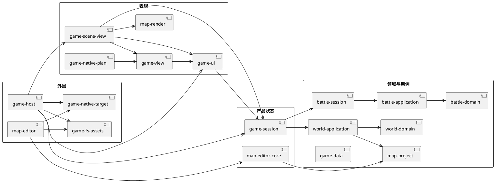

# 系统总览

## 结论

项目不是一个单一游戏程序，而是一个有 34 个 Cargo package 的 workspace。它当前产出三个可执行入口：原生游戏、原生地图编辑器、数据导入 CLI。主业务路径已经形成两条产品线：玩家游戏和地图制作；它们共用数据、资产、地图格式、网格渲染和原生 GPU 后端。

最重要的产品状态在 `game-session`。最重要的可编辑文档状态在 `map-project` / `map-editor-core`。窗口、文件和 GPU 都在外围 crate，而不是领域 crate。

## Workspace 形状

```text
pokemon-untitled/
├── crates/
│   ├── foundation/    6 packages: Punctum 基础设施模型和 Ramus 核心
│   ├── domain/        4 packages: 战斗、游戏数据、地图文档、世界规则
│   ├── application/   5 packages: 战斗/世界用例、游戏会话、编辑器状态机
│   ├── presentation/  9 packages: UI 状态、视图投影、资产和帧计划
│   ├── adapter/       7 packages: 文件、导入、脚本、WGPU、终端适配
│   ├── runtime/       2 packages: game-host、map-editor 可执行程序
│   └── quality/       1 package: 跨层游戏故事测试
├── assets/            工作区级原始资产、导入数据和受控目录
├── maps/              可编辑地图项目，例如 demo-map.json
├── fixtures/          已批准的规则和演示阵容固定件
└── scripts/           数据、资产和覆盖率维护工具
```

`assets/` 与 `maps/` 不属于任一 crate。前者由 Git LFS 跟踪，后者是普通 Git 文本。这个区别合理：图像和原始数据体积大，而地图项目需要便于审阅和合并。

## 当前组件图



这张图省略了 Punctum、资产和数据导入的底层依赖，目的是突出产品状态的所有权。`game-host` 和 `map-editor` 是组装根，直接依赖较多 crate 是预期行为；其他层不应以此为借口相互穿透。

## 三个可执行入口

| 入口 | package | 输入 | 主要输出 | 直接副作用 |
| --- | --- | --- | --- | --- |
| 原生游戏 | `game-host` | Winit 键盘/IME/时间、根目录资产和地图 | WGPU 帧与窗口标题 | 窗口、时钟、文件、GPU、stderr |
| 地图编辑器 | `map-editor` | 鼠标、键盘、地图路径、资产 | WGPU 编辑器帧、JSON 地图文件 | 窗口、文件、GPU、stderr |
| 数据导入 | `game-data-import` | CSV 目录、CLI 参数 | 验证后的 `v2.json` | 读取 CSV、创建目录、原子替换输出文件 |

## 已实现的分层

| 层 | 合理职责 | 当前的主要 package |
| --- | --- | --- |
| Foundation | 与业务无关的数据结构、输入和渲染数据模型 | `punctum-*`、`ramus-core` |
| Domain | 业务不变量、格式校验、确定性规则 | `battle-domain`、`world-domain`、`map-project`、`game-data` |
| Application | 业务动作编排、观察投影、会话状态机 | `battle-application`、`battle-session`、`world-application`、`game-session`、`map-editor-core` |
| Presentation | 输入解释、视觉状态、语义视图、帧计划 | `game-ui`、`game-view`、`game-scene-view`、`map-render` 等 |
| Adapter | 将平台、文件和外部格式翻译为内部模型 | `game-fs-assets`、`game-data-import`、`punctum-wgpu` 等 |
| Runtime | 组合依赖，拥有进程和窗口生命周期 | `game-host`、`map-editor` |
| Quality | 用完整主路径验证跨层行为 | `game-e2e` |

## 需要正确理解的例外

1. `map-project` 在目录上属于 domain，但它也承担 JSON 序列化和可逆编辑历史。这是“项目文档领域”的合理组成，不是通用游戏运行时状态。
2. `game-data` 在目录上属于 domain，但当前的 `embedded()` 直接用 `include_bytes!` 编译 `assets/source/data/game/current-dataset/v2.json`。因此数据版本变化会触发 Rust 重新编译。
3. `game-ui` 是表现层，却拥有菜单、控制台、动画计时和按键保持状态。它不应拥有 `GameSession`，但当前通过 `GameCommand` 驱动它。
4. `game-view` 依赖 `game-ui` 的 `PresentationSnapshot`。这使“表现状态 -> 视图”成立，但也表示 presentation 内部已经有依赖方向，不能简单要求所有 presentation crate 独立。
5. `battle-ramus-adapter` 是 adapter，却被 `game-ui` 直接使用，原因是控制台需要把安全受限的文本调用翻译为合法战斗动作。

## 当前产品切片

| 切片 | 已可走通 | 尚未形成的长期能力 |
| --- | --- | --- |
| 世界探索 | 格子移动、朝向、墙体阻挡、进入草地触发战斗 | 多地图、地图连接、NPC、任务、事件参数、持久世界 |
| 战斗 | 种子确定性的 6v6 单打、行动、回放、替换、状态/天气/部分特性和招式效果 | 完整 Gen3 机制、训练师/野生配置、长期队伍、联网/AI 分级 |
| 图鉴与数据 | 386 个 Gen3 图鉴条目、PokeAPI 导入、资产键目录 | 运行时数据版本选择、mod、数据迁移和在线更新 |
| 地图制作 | 分层地图 JSON、画笔、材料、撤销/重做、保存 | 实体层、事件参数、区域、校验器、项目索引和协作 |
| 原生显示 | Winit、WGPU、图集、文字覆盖层、IME | 多后端发布、无头测试渲染、可访问性和 UI 主题 |

## 推荐阅读

- 要了解“玩家按键后发生什么”，读 [运行时流程](003-runtime-flows.md)。
- 要定义玩法和项目格式，读 [`002-domains/`](../002-domains/)。
- 要新增 crate 或判断依赖是否合理，读 [依赖规则](../003-layers/005-dependency-rules.md)。
