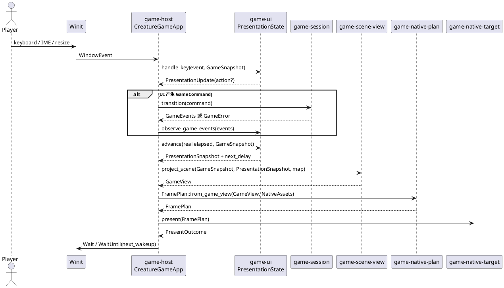
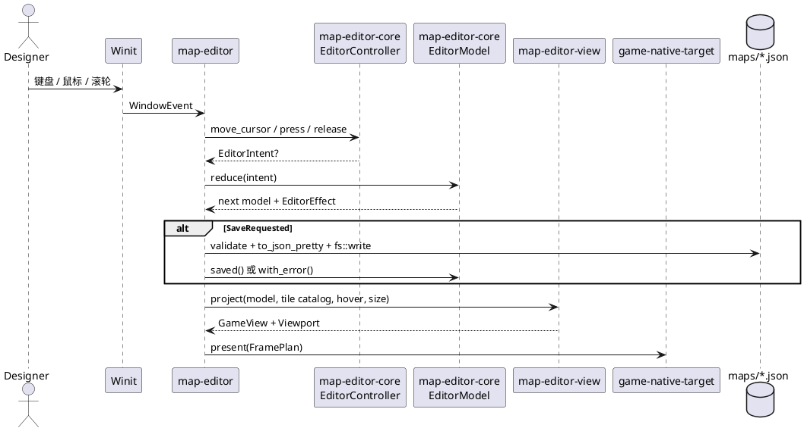
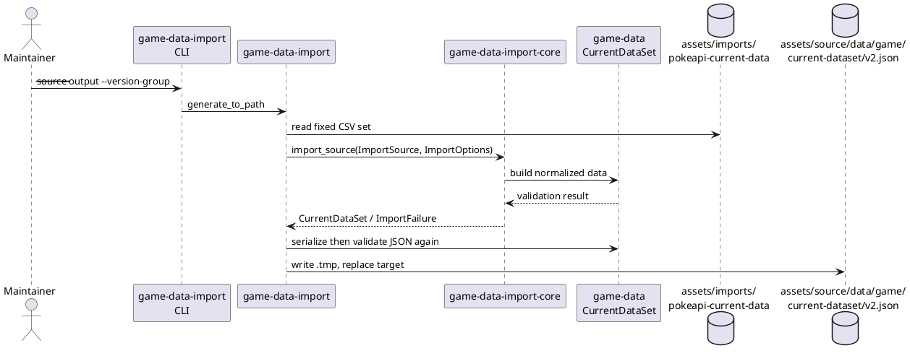

# 运行时流程

## 结论

两个 GUI 程序都采用相同的外围结构：运行时 crate 收集平台事件，调用纯或近纯的核心生成状态/视图，再把 `FramePlan` 提交给原生 GPU 目标。差别在于游戏把时间和玩法状态分开，编辑器把持久化请求作为 `EditorEffect::SaveRequested` 交给运行时执行。

## 原生游戏启动和帧循环

启动时 `game-host` 依次加载地图项目、将地图转换为世界、构建 `GameSession`、生成演示队伍的精灵请求、加载资产，再创建窗口和 `NativeTarget`。游戏数据和图鉴数据目前通过 `include_bytes!` 编译进二进制；图片和地图则在启动时从 workspace 根目录读取。

### 游戏状态边界

| 状态 | 所有者 | 何时变化 |
| --- | --- | --- |
| 世界、战斗、场景和演示队伍种子 | `GameSession` | `GameCommand` 被接受时 |
| 菜单页、控制台、按键、世界位移插值、战斗回放计时 | `PresentationState` | 输入、`GameEvents` 或逻辑时间推进时 |
| 窗口、修饰键、上次真实时间、下一次唤醒时间、GPU target | `CreatureGameApp` | Winit 平台循环中 |
| 地图文档、图集、图鉴 | `CreatureGameApp` 初始化后只读 | 启动加载时 |

`game-host` 用 `Instant` 把真实时间转换成 `Duration`，再传给 `PresentationState::advance`。表现层不直接读取时钟，因此动画可用确定的逻辑时间测试。控制台打开时，`PresentationState::next_delay` 返回空值，表现时间暂停。

## 地图编辑器循环

编辑器不是游戏的一个模式。它有单独的运行时和核心状态机，复用地图项目格式、资产加载、地图投影和 WGPU 目标。

编辑器的 `EditorEffect` 目前只有 `None` 与 `SaveRequested`。这是一个健康的接口：核心不直接调用文件系统。后续新增导出、自动保存、资源重新加载时，应继续增加效果枚举或明确的端口，不要让 `EditorModel` 直接操作路径。

## 数据导入流程

`game-data-import` 是开发时工具，不在原生游戏启动路径上。它读取固定的一组 PokeAPI CSV 文件，交给无文件 I/O 的 `game-data-import-core` 解析、诊断和归一化，最后验证 JSON 并用临时文件替换目标文件。

## 副作用清单

| 副作用 | 当前边界 | 不应放置的位置 |
| --- | --- | --- |
| 文件读取 | `game-fs-assets`、`game-data-import`、两个 runtime 的装配代码 | domain、application、视图投影 |
| 文件写入 | `game-data-import`、`map-editor` 的 `save` | `map-project`、`map-editor-core` |
| 真实时间 | `game-host` | `game-session`、`game-ui` 的逻辑 API |
| 窗口和事件循环 | `game-host`、`map-editor` | Punctum、领域或用例 crate |
| WGPU 设备与表面 | `punctum-wgpu`、`game-native-target` | `game-view`、`game-native-plan` |
| 外部命令语法与授权 | `battle-ramus-adapter`、`ramus-core` | `battle-domain` |

## 运行流程的限制

1. `game-host` 在启动时将地图、资产、图鉴和游戏会话装配在一个 `CreatureGameApp` 内。当前规模合理；新增存档、设置、音频或网络时应避免继续把所有资源塞入该 struct。
2. 游戏的随机种子来自系统时间和进程 ID。战斗与演示队伍一旦得到种子后可重演，但“新游戏”的初始种子尚未成为可持久化输入。
3. 地图编辑器保存直接覆盖目标路径。它已通过 `MapProject::to_json_pretty` 和验证保护格式，但尚无备份、冲突检测或原子重命名。
4. WGPU 是当前唯一实际使用的 GUI 渲染目标。`punctum-crossterm` 已具备独立适配能力，但没有被这两个 runtime 入口装配。
