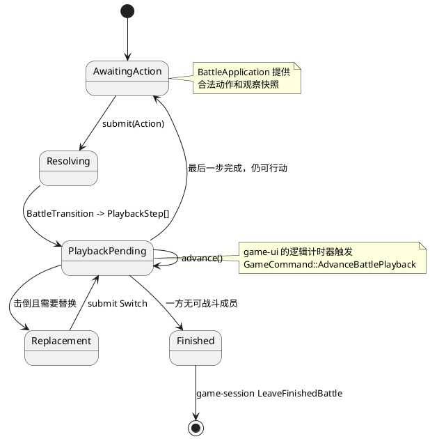
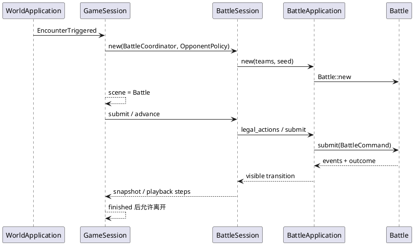

# 战斗领域

## 结论

战斗已经是项目中最完整、最有明确不变量的领域。`battle-domain` 拥有可复现的战斗规则和完整内部状态；`battle-application` 决定观察者可见的信息；`battle-session` 把一次提交拆成可播放步骤；`game-session` 决定一场战斗何时进入和退出整局游戏。

因此，新增招式或规则不能直接从 UI 改起。应先在 `battle-domain` 定义规则和事件，再在观察、回放和视图层扩展其可见表示。

## 当前能力边界

当前核心是“Gen3 风格 6v6 单打”，每边一个活跃宝可梦。根目录的 `fixtures/battle-rules-v0.1.json` 记录了早期核心规则，但它没有跟上战斗源码：该文件声称没有特性、状态、天气、能力等级和招式附加效果，而当前源码与测试已经实现了这些能力。因此它不能再作为当前规则范围的唯一依据。

| 当前源码中有测试覆盖的规则 | 尚未由当前证据确认的完整机制 |
| --- | --- |
| 队伍 6 人、每只最多 4 招；换人、优先度、速度、种子 RNG | 持有物系统 |
| PP、命中、Struggle、暴击、STAB、属性克制、击倒与强制替换 | 多回合和多段招式 |
| 烧伤、中毒、麻痹、睡眠等主要状态；能力等级变化与命中/闪避 | 场地、side、入场陷阱、束缚、追击等完整场景 |
| 雨、晴、冰雹、沙暴及天气特性；特性触发和部分阻断/增益规则 | 全量 Gen3 招式、特性、边缘时序和数据驱动规则表 |
| 治疗、吸血、反伤、固定伤害、畏缩、替身、保护、Haze、Rest、Refresh 等效果 | 任何未由测试和事件协议共同锁定的机制 |

`battle-domain::model` 已有 `Ability`、`Weather`、`MajorStatus`、`StatStages`、`MoveEffect` 等模型，且 `Battle` 执行路径会产生对应的 `BattleEvent`。是否实际生效应以 `Battle` 执行路径和测试为准；在 fixture 更新前，不能再把该 JSON 当成完整的批准规则集。

## 战斗包职责

| package | 负责 | 不负责 |
| --- | --- | --- |
| `battle-domain` | 宝可梦、招式、队伍、伤害、合法动作、RNG、事件日志、胜负 | 视角隐藏、菜单、动画、平台输入 |
| `battle-application` | 基于 `Side` 的观察、合法动作、checkpoint 和可见 transition | 回放节奏、AI 策略、整局场景切换 |
| `battle-session` | 玩家交互、对手策略、将 transition 化为 `PlaybackStep` | 地图遭遇、窗口和真实时间 |
| `battle-ramus-adapter` | 将受授权的文本调用映射为 `Action` | 改写领域规则或绕过合法动作检查 |
| `game-session` | 创建演示队伍、持有一场战斗、处理进入/离开条件 | 渲染菜单或解析脚本语法 |

## 状态与回放

`BattleApplication` 的 `BattlePerspective` 是信息边界。它将领域内部状态投影为某一方可见的 `BattleObservation` 和 `BattleEvent`。下游 UI 应依赖这个观察模型，而不应检查 `Battle` 内部的对手招式、全队隐藏信息或随机数状态。

`BattleSession
` 用 `OpponentPolicy` 抽象对手决策。当前 `GameSession` 注入的是演示策略：优先选招式，否则选择第一个合法动作。这个 trait 是后续野生 AI、训练师 AI、网络对手和测试脚本的自然接入点。

## 整局游戏中的位置

## 可扩展点

| 目标 | 首先修改 | 随后必须检查 | 设计注意点 |
| --- | --- | --- | --- |
| 新招式效果 | `battle-domain` 的模型、解析和结算 | 规则 fixture、观察事件、回放 reducer、UI 文案 | 先定义事件语义；动画不要从内部状态猜测。 |
| 特性、状态、天气 | `battle-domain` 的规则执行路径 | 可见性、事件顺序、快照、回放 | 已有类型不等于已有不变量；需写出叠加优先级。 |
| 训练师/野生配置 | 新的领域或应用配置模型 | `GameSession` 的遭遇创建 | 不要继续把演示队伍和固定 seed 当作产品配置。 |
| 多种 AI | `OpponentPolicy` 实现或更明确的策略端口 | 确定性测试、超时/取消策略 | 策略输入应只得到允许的 `BattleObservation`。 |
| 联机/重放存档 | 命令日志和确定性 seed 的正式格式 | 版本、数据集版本、规则版本 | 先锁定序列化协议；不要序列化私有 Rust 内存布局。 |

## 当前缺口与风险

1. 规则 fixture 已与源码漂移。必须先决定它是更新为当前规则规范、拆成版本化 fixture，还是降级为历史基线；在此之前，不能用它作为回归范围或产品承诺。
2. 演示队伍由当前数据集和 `roster_seed` 临时生成，尚未表达玩家、训练师、野生遭遇表或成长进度。
3. `battle-session` 的回放队列适合离散事件。连续特效、粒子、音频或可跳过动画应扩展 `PlaybackStep` 的语义，而不是在 host 中另建与战斗不同步的计时器。
4. Ramus 当前只暴露一条、无参数、长度受限的战斗动作调用。把它扩展成通用脚本前，应先决定授权主体、持久化、错误恢复和脚本数据版本。
