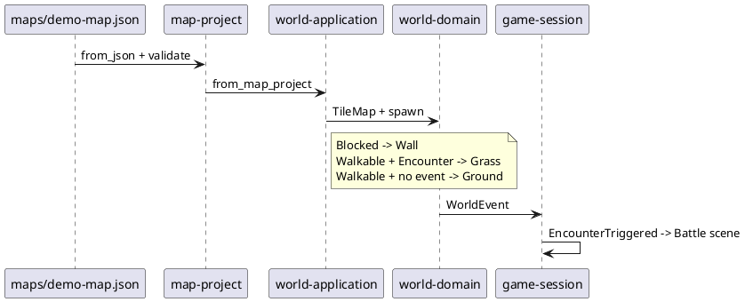

# 世界与地图领域

## 结论

地图项目和可玩世界是相邻但不同的模型。`MapProject` 是可保存、可编辑、保留视觉/碰撞/事件三层的文档；`World` 是运行时的整数格规则。`WorldApplication::from_map_project` 当前只投影碰撞和“遭遇”事件，因此地图文档的很多信息尚未成为世界玩法。

这条边界很重要：新增 NPC、传送门或剧情事件时，应先扩展地图事件模型和世界事件模型，不能只在渲染层放一张图片。

## 地图项目模型

```plantuml
@startuml
class MapProject {
  format_version: String
  id: MapProjectId
  tile_size: TilePixelSize
  width: u16
  height: u16
  materials: CompositeTile[*]
  visual_cells: VisualCell[*]
  collision_cells: Collision[*]
  event_cells: MapEventKind?[*]
  player_spawn: TilePosition
}
class CompositeTile {
  id: CompositeTileId
  layers: AtomicTileId[*]
}
class VisualCell { material: CompositeTileId? }
enum Collision { Walkable; Blocked }
enum MapEventKind { Encounter }

MapProject *-- CompositeTile
MapProject *-- VisualCell
MapProject *-- Collision
MapProject *-- MapEventKind
CompositeTile --> AtomicTileId
@enduml
```

`MapProject` 有 `format_version = "gen3-map-v1"`，并校验尺寸、层长度、出生点、材料引用和原子 tile ID。`EditHistory` 与 `MapEditCommand` 使编辑操作可逆。视觉、碰撞和事件不是一个 cell struct 的序列化字段，而是三个平行数组；这使每层独立编辑和校验成为可能。

## 从项目到可玩世界



`world-domain` 只认识 `Ground`、`Wall` 和 `Grass`。移动会改变朝向；越界或撞墙产生 `Blocked`；从非草地进入草地生成 `EncounterTriggered`。这是一套纯整数格规则，没有文件、随机数、精灵或 UI。

当前转换的损失是有意且可见的：地图的组合 tile 仅用于渲染，碰撞只保留为墙/可走，事件只有 `Encounter` 会影响玩法。若未来出现不止一种事件，不能继续用 `Option<MapEventKind>` 后接更多特判而不定义执行模型。

## 地图制作路径

| 层 | package | 职责 |
| --- | --- | --- |
| 格式与编辑命令 | `map-project` | JSON、校验、材料、分层 cell、撤销/重做 |
| 编辑交互状态 | `map-editor-core` | 工具、意图、指针控制器、工作台布局、`EditorEffect` |
| 资产到地图资源 | `map-assets` | 校验 16x16 PNG，创建原子 tile 目录和默认项目 |
| 地图到语义图层 | `map-render` | 摄像机、格布局、组合 tile 到 `MapScenePlan` |
| 编辑器画面 | `map-editor-view` | 面板、hover、错误与 `GameView` 投影 |
| 保存和窗口 | `map-editor` | 路径选择、文件写入、Winit/WGPU 生命周期 |

## 可扩展点

| 需求 | 推荐落点 | 需要同步的边界 |
| --- | --- | --- |
| 传送点和地图连接 | `MapEventKind` 的带参数事件 + 世界用例 | `MapProject` JSON 迁移、世界事件、地图注册表、存档位置 |
| NPC、宝箱、触发器 | 新增实体/对象层，不要塞进 `VisualCell` | 渲染、碰撞、交互命令、事件执行、编辑器工具 |
| 遭遇表与区域 | 地图事件引用领域定义的 encounter zone | `GameSession` 的战斗创建、数据集版本、调试可视化 |
| 多地图世界 | 独立的 `WorldProject` 或 map registry | 地图 ID、加载端口、跨图坐标、存档迁移 |
| 自动保存 | 运行时 effect/端口 | 不能让 `EditorModel` 或 `MapProject` 写文件 |
| 协作和合并 | 稳定 cell 变更格式或操作日志 | `EditHistory` 不能直接当跨版本协议 |

## 当前限制

1. `WorldApplication::demo()` 仍保留硬编码 16x10 测试世界；真正游戏入口已经改用 `from_map_project`，所以新增玩法应以地图项目为起点。
2. 地图默认项目由 `map-assets` 在没有 JSON 时生成。这方便启动，但不适合作为正式项目初始化策略；产品化后应让创建模板成为显式命令。
3. 编辑器拥有鼠标交互，游戏当前只处理键盘/IME。两者共享底层输入模型的程度有限，不能假设 UI 交互已通用化。
4. `maps/demo-map.json` 是普通 Git 内容，但它引用的 tile 由 LFS 资产目录决定。地图版本与资产目录版本之间尚无显式 manifest 约束。
