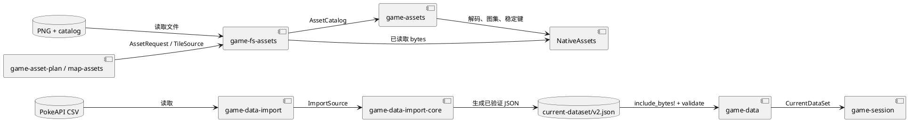

# 游戏数据与资产

## 结论

项目把“结构化玩法数据”和“二进制视觉资源”同时放在 workspace 根目录的 `assets/`，并为两者建立了不同的访问链。数据由 `game-data` 验证和嵌入；图像由目录清单、稳定 `AssetKey` 和文件系统 adapter 按需读取。这个分离避免了视图层暴露真实路径，但当前仍缺少一个统一的运行时资源版本声明。

## 资产树与来源

```text
assets/
├── source/                    规范化后的可消费资源
│   ├── data/game/current-dataset/v2.json
│   ├── data/game/pokedex/gen3.v1.{json,bin}
│   ├── map/tile/...png
│   ├── pokemon/...png
│   └── character/...png
├── catalog/
│   ├── assets.v1.json         key -> source、大小、hash、尺寸
│   └── assets.v1.lock.json    可复核的锁定快照
└── imports/
    └── pokeapi-current-data/  导入原始 CSV、来源说明和校验和
```

`.gitattributes` 对 `assets/**` 启用 Git LFS。`maps/`、`fixtures/` 和 Rust 源码不使用 LFS。`scripts/assets/verify_catalog.py` 验证目录中每个文件都恰好被 catalog 引用，并校验键名、长度、SHA-256 和 PNG 尺寸。

## 两条访问链



### 结构化数据

`game-data` 定义 `CurrentDataSet`、宝可梦形态、能力、属性、招式、学习表和数据元信息。它校验 schema 和排序后的查询语义。`CurrentDataSet::embedded()` 编译 `v2.json`；`PokedexData::embedded_gen3()` 编译二进制图鉴索引。后者由 `scripts/build_pokedex.py` 根据当前数据集和规范正面精灵生成，固定范围为全国图鉴 1-386。

`game-data-import-core` 只处理 CSV 内容、选项和诊断。`game-data-import` 才负责读取固定的 PokeAPI 文件清单和发布文件。导入器把固定来源 commit `d638fe...` 写入数据元信息，`game-data` 测试会检查该固定快照。

### 视觉资源

`game-assets` 的稳定边界是 `AssetKey`，不是路径或 `ResourceId`。catalog 的 `source` 必须在 `source/` 下；`game-fs-assets` 根据 `AssetRequest` 读取字节；`game-asset-plan` 对演示队伍、属性图标、菜单和程序化圆角遮罩生成请求；`map-assets` 约束地图 tile 为 16x16 PNG；最后 `NativeAssets` 构建单张 GPU 图集。

## 数据所有权表

| 数据 | 规范所有者 | 读取者 | 修改方式 |
| --- | --- | --- | --- |
| PokeAPI 原始 CSV | `assets/imports/` | 数据导入工具 | 外部来源更新后重新导入 |
| 当前玩法数据集 | `assets/source/data/game/current-dataset/v2.json` | `game-data`、`game-session` | `game-data-import` 生成并校验 |
| Gen3 图鉴二进制索引 | `assets/source/data/game/pokedex/gen3.v1.bin` | `game-data`、图鉴视图 | `scripts/build_pokedex.py` 生成 |
| 图像与 tile | `assets/source/` + catalog | 文件系统 adapter、资产计划 | 导入/规范化后更新 catalog |
| 地图项目 | `maps/*.json` | runtime、编辑器 | `map-editor` 或文本编辑，随后校验 |
| 规则批准范围 | `fixtures/battle-rules-v0.1.json` | 测试与维护者 | 先评审规则，再同步代码与 fixture |

## 扩展建议

| 需求 | 建议 |
| --- | --- |
| DLC、mod 或多套数据 | 为数据集和 asset catalog 引入显式 bundle manifest，记录 schema、内容 hash、相互兼容范围和加载优先级。 |
| 热重载 | 在 adapter/runtime 层监视文件，重新构建 `NativeAssets`；不要让 `game-view` 直接读路径。 |
| 存档引用数据 | 存档记录 `CurrentDataSet.metadata` 和资源 bundle 版本，不只记录内部 ID。 |
| 资产变更审计 | catalog lock 已有 hash 基础；可加生成器版本和来源许可字段。 |
| 商业发布 | 明确每组资源来源、许可证和再分发条件；目录结构本身不构成许可证管理。 |

## 当前风险

1. `include_bytes!` 把数据集和图鉴索引编入二进制。它提供强一致性，但运行时不能选择数据版本，也会放大构建依赖。
2. game host 中有一个已忽略测试，记录了某个宝可梦背面精灵缺失导致完整图集测试暂不通过。这说明 catalog 完整性和“当前游戏请求集完整性”是两种不同检查。
3. `AssetKey` 已经是稳定语义标识，但 map 项目对资产 bundle 版本没有引用；升级/删除 tile 时需要明确迁移策略。
4. 当前 catalog 已有一条可复现失配：`data/game/current-dataset/v2` 记录的长度为 `3,321,534`、SHA-256 为 `1e94...`, 实际 `source/data/game/current-dataset/v2.json` 的长度为 `3,558,965`、SHA-256 为 `31e6...`。因此 `python scripts/assets/verify_catalog.py` 当前会在该条目失败，需重新生成或更新 catalog/lock 后才能将它作为 CI 门禁。
5. 资产目录由 LFS 管理，迁移或 CI 环境必须保证 LFS 文件实际下载；仅有 Git 指针不能通过 PNG 解码和 catalog 校验。
