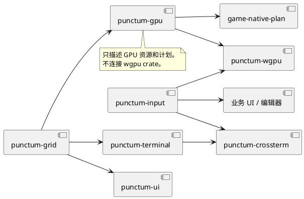
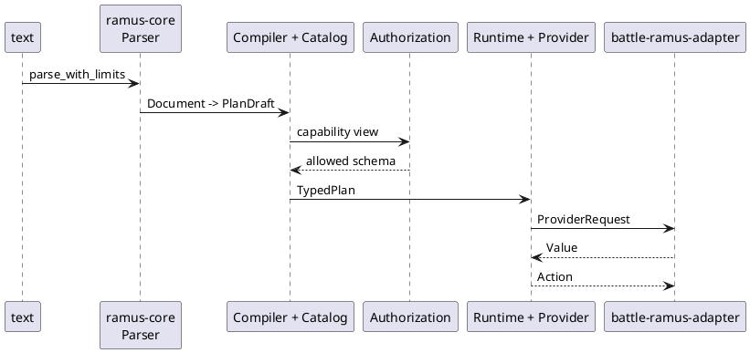

# Foundation 层

## 结论

Foundation 层提供可复用的技术模型，不知道宝可梦、地图或游戏流程。Punctum 将网格、输入、GPU 计划、终端和声明式 UI 拆开；Ramus 提供有能力授权的命令语言核心。这里最重要的规则是：基础 crate 可以定义类型、算法和 trait，不能反向依赖业务 crate 或实际窗口/GPU 设备。

## Package 清单

| package | 当前职责 | 关键公开概念 | 不应承担 |
| --- | --- | --- | --- |
| `punctum-grid` | 二维整数几何、`Surface<T>`、diff 和 patch 应用 | `GridPos`、`GridSize`、`GridRect`、`Patch` | 像素、窗口、游戏 tile 语义 |
| `punctum-input` | 平台无关的键盘、修饰键和已提交文本合同 | `KeyEvent`、物理/逻辑键、`TextEvent` | Winit/Crossterm 类型、快捷键业务解释 |
| `punctum-gpu` | GPU 资源、图集、像素/视口模型和提交计划 | `GpuAtlas`、`GpuCell`、`SubmissionPlan` | `wgpu::Device`、着色器生命周期、文本栅格化 |
| `punctum-terminal` | 终端 cell、宽字符文本写入、surface patch 到终端运行计划 | `TerminalCell`、`TerminalPlan` | 读取终端事件、stdout 生命周期 |
| `punctum-ui` | 泛型布局树和绘制 trait | `Ui`、`Node`、`Constraints`、`PaintTarget` | 游戏菜单状态、字体后端、具体皮肤 |
| `ramus-core` | 解析、schema、能力、编译计划和 provider 执行边界 | `Compiler`、`Catalog`、`Runtime`、`Capability` | 战斗动作或游戏数据的具体 provider |

## Punctum 分层

`punctum-gpu` 与 `punctum-wgpu` 的分离尤其有价值。前者可在无图形设备的测试中验证图集、clip、实例编码和提交计划；后者才创建 surface、device、queue、pipeline 和 atlas texture。新增 Vulkan/WebGL/软件渲染后端时，应实现新的 adapter，而非把平台代码写进 `punctum-gpu`。

## Ramus 的位置

`battle-ramus-adapter` 将 Ramus 放在战斗命令的外围：它固定 local-player principal、允许的能力、调用路径和长度限制，再把 provider 输出转换为 `battle_application::Action`。这比 UI 直接解释任意字符串安全，也避免 `battle-domain` 依赖脚本语法。

## Foundation 的边界规则

1. Foundation crate 不依赖 `domain`、`application`、`presentation`、`adapter` 或 `runtime`。
2. Foundation API 只能暴露通用单位、类型参数或 trait；如出现 `Pokemon`、`MapProject`、`GameCommand`，应移动到上层。
3. `punctum-input` 只标准化事件，不决定某按键是走路、菜单还是画笔。
4. `punctum-gpu` 只生成数据计划，不获得 `wgpu::Device` 或窗口句柄。
5. Ramus 的 `Provider` 是外部能力端口。具体的文件、网络、战斗或任务 provider 必须放在 adapter 或产品集成层。

## 发现的维护项

物理目录中同时存在 `crates/foundation/ramus/crates/ramus-core/` 和 `crates/foundation/ramus/ramus/crates/ramus-core/` 两个同名源码树。`cargo metadata` 只将前者对应的 package 纳入根 workspace。两个树当前都含有 Rust 源码，容易导致维护者修改了未参与构建的副本。

这是仓库卫生风险，不是立即的运行时 bug。后续应确认嵌套 `ramus/` 是有意的独立副本、误提交镜像还是子项目残留；确认后保留唯一权威来源或为独立副本明确边界。不要在未确认前删除它。

## 新能力落点

| 需求 | 位置 |
| --- | --- |
| 新的网格算法 | `punctum-grid`，前提是没有游戏语义 |
| 新的键盘/手柄标准化 | `punctum-input` + 对应 adapter |
| 新的平台图形后端 | 新 adapter，消费 `punctum-gpu::SubmissionPlan` |
| 终端游戏原型 | runtime 组合 `punctum-terminal` + `punctum-crossterm`，不要改现有 WGPU 计划模型 |
| 可复用布局控件 | `punctum-ui`；若绑定宝可梦菜单状态，则属于 `game-ui` |
| 可授权的文本命令 | `ramus-core` 定义通用能力，具体 provider 放 adapter |
