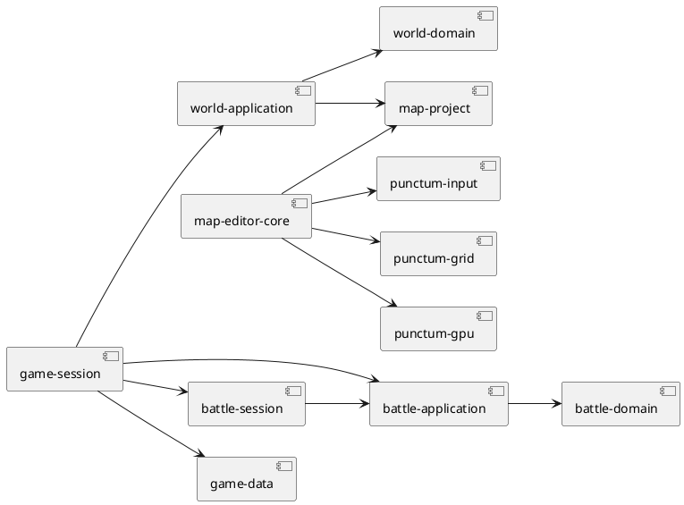

# Domain 与 Application 层

## 结论

Domain 表达“什么是有效的业务状态和规则”，Application 表达“一个动作如何协调多个领域对象并给下游一个合适的观察”。项目大部分领域操作都返回新状态或显式结果，便于确定性测试。`GameSession` 是产品级例外：它可变地持有整局状态，但仍通过消费/返回 `self` 的 `transition` API 保持调用边界明确。

## Domain package

| package | 业务所有权 | 主要内容 | 已知边界 |
| --- | --- | --- | --- |
| `battle-domain` | 回合制战斗真实状态和规则 | `Battle`、队伍、宝可梦、招式、属性、伤害、事件、种子 RNG | 不知道观察者可见性、动画或对手策略 |
| `game-data` | 静态游戏数据的 schema 与查询有效性 | 当前数据集、图鉴、宝可梦/招式/属性记录、元信息 | 当前有编译期嵌入资源，不是纯内存格式 crate |
| `map-project` | 可编辑地图文档的有效性和可逆修改 | map JSON、tile/material、视觉/碰撞/事件层、历史 | 不解释这些 event 如何改变游戏 |
| `world-domain` | 整数格移动、阻挡和进入草地 | tile map、位置、朝向、世界 command/event | 只知道 Ground/Wall/Grass，不能表达一般事件 |

## Application package

| package | 用例职责 | 输入和输出 | 不应持有 |
| --- | --- | --- | --- |
| `battle-application` | 按观察方投影战斗，并维护 checkpoint | `BattlePerspective` -> `BattleObservation` / `BattleTransition` | 回放计时、菜单状态 |
| `battle-session` | 组织玩家与策略对手，生成离散回放步骤 | action + `OpponentPolicy` -> `BattleSessionSnapshot` / steps | 世界、窗口、真实时间 |
| `world-application` | 把 `MapProject` 转为 `World`，提供观察 | project + `WorldCommand` -> `WorldObservation` / outcome | 地图文件、精灵、摄像机 |
| `game-session` | 整局游戏场景、世界与一场战斗的生命周期 | `GameCommand` -> `GameEvents` + `GameSnapshot` | 输入设备、动画、磁盘存档 |
| `map-editor-core` | 编辑工具、意图、控制器和可保存效果 | key/mouse intent -> model + `EditorEffect` | 文件写入、GPU、窗口 |

## 主状态所有权

```plantuml
@startuml
class GameSession {
  data: CurrentDataSet
  world: WorldApplication
  battle: GameBattleSession?
  scene: GameScene
  roster_seed: u64
}
class WorldApplication { world: World }
class GameBattleSession { session: BattleSession }
class BattleSession { coordinator: BattleCoordinator }
class BattleCoordinator { application: BattleApplication }
class BattleApplication { battle: Battle }

GameSession *-- WorldApplication
GameSession *-- GameBattleSession
GameBattleSession *-- BattleSession
BattleSession *-- BattleCoordinator
BattleCoordinator *-- BattleApplication
BattleApplication *-- Battle
@enduml
```

这条链回答“谁能改变哪一层状态”：运行时把 `GameCommand` 交给 `GameSession`；它再委托世界或战斗会话。UI 只能得到快照和事件。新业务状态应优先纳入这条链，或明确建立另一条产品状态链，而不是放进 host 的字段中。

## 命令、事件与快照

| 类型 | 用途 | 示例 |
| --- | --- | --- |
| Command / Intent | 请求改变状态 | `GameCommand::StepWorld`、`MapEditCommand`、`EditorIntent` |
| Outcome / Event | 报告已发生的业务结果 | `WorldEvent::EncounterTriggered`、`GameEvent::BattleStarted` |
| Observation / Snapshot | 给下游读取的稳定投影 | `GameSnapshot`、`BattleObservation`、`WorldObservation` |
| Effect | 由核心请求外围执行 | `EditorEffect::SaveRequested` |

当前命名并非所有 crate 完全统一，但意图一致。新增 API 时建议优先选上表的语义，不要返回含糊的 bool 或让 UI 读取私有状态猜结果。

## 当前依赖形状



`map-editor-core` 使用 `punctum-gpu` 和 `punctum-grid` 来定义编辑工作台布局。这是当前实现的事实；若编辑布局逐渐需要更多视觉样式，可以考虑把纯布局数据继续留 core，把具象层和资源 key 留 view。

## 新用例的放置准则

| 情形 | 位置 | 例子 |
| --- | --- | --- |
| 规则可脱离产品运行 | domain | 状态异常优先级、地图 event 的合法结构 |
| 协调一个领域对象但不产生 UI | application | 任务完成、队伍管理、遭遇表选择 |
| 需要保存/网络/平台 | adapter + runtime，application 定义请求接口 | 存档、远程对战、文件导出 |
| 需要整局场景切换 | `game-session` 或将来明确的产品 session | 进入商店、进入地图、返回标题 |
| 只改变菜单或动画 | presentation | 对话框翻页、过场淡入、hover |

## 需要谨慎演进的点

1. `GameSession::new_demo`、默认地图和演示队伍适合当前 slice。正式新游戏创建应变成显式的产品配置，避免 demo 名称和常量扩散。
2. `world-application` 同时依赖 `map-project` 与 `world-domain`，是文档模型到规则模型的翻译层。它不应变成加载地图文件或渲染 tile 的位置。
3. `game-data` 被 `game-session` 直接持有以生成队伍。将来支持可切换数据 bundle 时，可引入只读 repository/lookup port；不要把 JSON reader 传入 battle domain。
4. `MapProject` 的编辑历史是内存撤销语义。跨进程审计、同步或持久回放需要单独的操作协议和版本策略。
