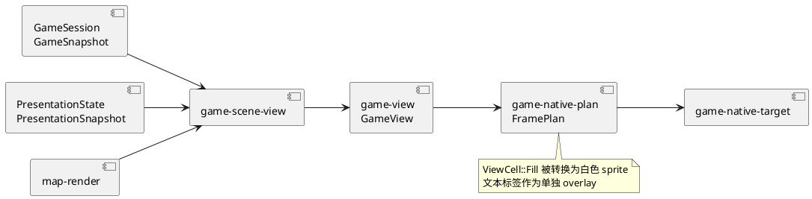
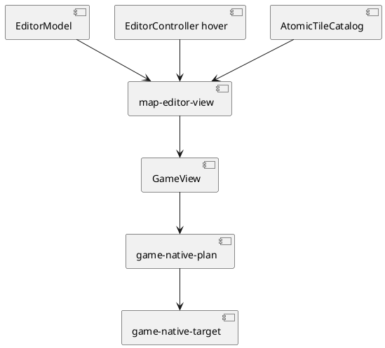

# Presentation 层

## 结论

Presentation 层负责两件不同的事：把输入和逻辑时间变成用户可感知的表现状态，以及把产品快照变成可提交的画面。当前实现已将二者拆为 `game-ui` 与 `game-*-view/plan`，但它们仍通过 `PresentationSnapshot` 紧密协作。新增视觉效果应先判断它是“状态/交互”还是“投影/绘制”，再选 crate。

## Package 清单

| package | 角色 | 输入 | 输出 |
| --- | --- | --- | --- |
| `game-assets` | 稳定 asset key、catalog、PNG 解码、图集 | bytes、描述符 | `DecodedImage`、`GpuAtlas` |
| `map-assets` | tile 约束和默认地图组装 | tile PNG bytes、项目 JSON | `TileAssets`、`MapProject` |
| `game-ui` | 菜单、控制台、动画、逻辑时间、按键状态 | 标准化输入、`GameSnapshot`、events | `PresentationAction`、`PresentationSnapshot` |
| `game-view` | 战斗、世界、图鉴、控制台的语义 canvas | 观察和表现快照 | 分层 `GameView` |
| `game-scene-view` | 选择当前场景并组合地图/战斗/pokedex | 所有当前 read model | `ProjectedScene` |
| `map-render` | 项目 tile 到地图图层 | project、camera、catalog | `MapScenePlan` |
| `map-editor-view` | 编辑器模型到画面 | editor model、hover、catalog | `GameView` + viewport |
| `game-native-plan` | `GameView` 到 GPU/text 提交计划 | view、assets、viewport | `FramePlan` |
| `game-asset-plan` | 演示游戏需要哪些资源及如何组装 | roster、图鉴、PNG bytes | `AssetRequest`、`NativeAssets` |

## 游戏视图管线

`GameView` 是语义渲染边界，不是 WGPU 命令。它包含 layer、surface、`ViewCell`、图片和文字标签。`FramePlan::from_game_view` 解析 asset key，生成 `SubmissionPlan` 与 `NativeTextLabel`。`game-native-target` 将计划提交给 WGPU/glyphon。这样可以在没有真实 GPU 的情况下测试投影和帧计划。

## 表现状态与产品状态

`PresentationState` 拥有以下短生命周期状态：战斗菜单页、图鉴选择、命令控制台、战斗播放剩余时间、精灵帧、方向按键、世界插值、转身暂停和跑步停止动画。它接受 `Duration`，并产生 `GameCommand` 或控制台执行请求。

它不能修改游戏快照。所有玩法改变都通过 `PresentationAction::Submit(GameCommand)` 返回给 host。host 执行命令后再把 `GameEvents` 反馈给 `PresentationState::observe_game_events`。这避免了同一个状态被 UI 与游戏核心各自维护。

## 地图编辑器视图管线

编辑器复用了 `GameView` 与 `FramePlan`，但不复用游戏的 `PresentationState`。这是正确的边界：它们共用绘制语义，不共用玩家菜单、战斗回放或世界移动状态。

## 视觉扩展的落点

| 需求 | 正确位置 | 常见错误 |
| --- | --- | --- |
| 新战斗菜单选择规则 | `game-ui` | 在 `game-view` 检查原始按键 |
| 新图层、精灵位置、战斗 HUD | `game-view` 或 `game-scene-view` | 在 WGPU runtime 中拼业务条件 |
| 地图 camera/遮挡绘制 | `map-render` | 将地图 tile 逻辑复制进 `game-view` |
| 新图像格式、图集策略 | `game-assets` / adapter | 让每个 view 直接解码文件 |
| 新圆角/遮罩资源 | `game-asset-plan` 或真实资产 | 仅改 `ViewCell::Fill`，因为下游仍会变成矩形 sprite |
| GPU primitive 或文字提交 | `game-native-plan` / `game-native-target` | 在 domain/application 引入 GPU 类型 |

## 现有耦合与控制策略

1. `game-view` 依赖 `game-ui` 的 `PresentationSnapshot`。保持它单向即可：`game-ui` 不能依赖 `game-view`，且 `PresentationSnapshot` 应维持小而稳定。
2. `map-render` 依赖 `game-view`，因为它使用 `GameView` 的 layer 语言。若未来出现非游戏地图导出，可抽取更通用的 scene IR，但当前不必提前拆分。
3. `game-asset-plan` 依赖较多上层只读类型，以便生成完整的演示资源请求。这是组装计划而不是渲染逻辑；它不应读取文件或创建 GPU device。
4. `FramePlan` 将 `ViewCell::Fill` 转成 `GpuCell::Sprite`。真正的曲线、圆角和复杂几何需要图像/mask 或新增下游 primitive，不能期待上游矩形 cell 自然变圆。
