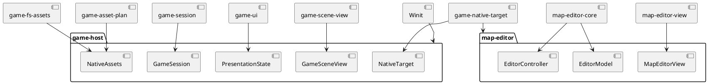

# Adapter 与 Runtime 层

## 结论

Adapter 将外部格式或平台翻译为项目模型；Runtime 组合 adapter、产品状态和表现层，拥有进程生命周期。当前 runtime 很薄但不是零逻辑：它应保留输入分发、effect 执行、真实时间转换、资源装配和错误报告，不能开始承载玩法规则或长期业务状态。

## Adapter package

| package | 外部边界 | 向内提供 | 不应泄漏 |
| --- | --- | --- | --- |
| `battle-ramus-adapter` | Ramus 文本命令、能力授权 | 已验证的 `Action` | 任意脚本执行权、领域内部状态 |
| `game-data-import-core` | CSV 表结构和导入诊断 | 纯 `ImportSource` -> `CurrentDataSet` | 文件系统和 CLI stdout |
| `game-data-import` | CLI、目录、文件发布 | `generate_to_path` 可执行工具 | CSV 细节到 game domain |
| `game-fs-assets` | 文件系统和 catalog JSON | asset bytes、tile source、可选文本 | 真实路径给 view/domain |
| `game-native-target` | WGPU、glyphon、surface 文字叠加 | `NativeTarget::present(FramePlan)` | WGPU 实例给上游视图 |
| `punctum-wgpu` | Winit 输入与 WGPU 设备/表面 | 标准化 input、`GpuRuntime` | 游戏业务类型 |
| `punctum-crossterm` | Crossterm 终端事件、stdout session | 标准化 input、terminal presenter | 游戏菜单和地图规则 |

`game-data-import-core` 的目录名位于 adapter，但它可被视为纯转换核心。当前拆分的收益是测试可以给它一个内存 `ImportSource`，而文件 I/O 仅在 `game-data-import`。

## Runtime package

| package | 运行时所有权 | 当前直接副作用 |
| --- | --- | --- |
| `game-host` | 一个 `GameSession`、`PresentationState`、地图/图鉴/资产只读快照、Winit app 生命周期 | 读 assets/maps、时钟、窗口、IME、WGPU、stderr |
| `map-editor` | 一个 `EditorModel`、指针 controller、项目路径、Winit app 生命周期 | 读 assets/maps、写项目 JSON、窗口、WGPU、stderr |

## 依赖组装图

## Runtime 写法规则

1. Runtime 可以拥有外部句柄、时钟和组装后的服务，但业务状态应放进 `GameSession`、`EditorModel` 或明确的新 session。
2. Runtime 可以将 `EditorEffect` 执行成文件写入，但不应让 `EditorModel` 知道 `PathBuf` 的来源或 Winit。
3. Runtime 可以将 Winit 事件标准化后交给 UI/core；快捷键业务解释不应散落在 `WindowEvent` match 中。
4. Runtime 处理错误时应保留结构化错误到模型或可观察日志。当前多处 `eprintln!` 合理用于开发运行时，但正式诊断可逐步统一。
5. Adapter 可依赖内层类型；内层不得反向依赖某个平台 crate，例如 `winit`、`wgpu`、`crossterm` 或 `std::fs`。

## 后续适配方向

| 目标 | 推荐新增边界 |
| --- | --- |
| 存档 | application 定义 `SaveGame`/snapshot schema；adapter 处理目录、原子写入和迁移文件 |
| 音频 | 独立 audio adapter，消费表现事件或明确的 audio cue，不让 battle domain 直接播放声音 |
| 手柄 | 将 SDL/Gilrs 等事件标准化到 `punctum-input`，由 `game-ui` 做动作解释 |
| Web/移动端 | 新 runtime + 新渲染/input adapter，继续消费 `GameView`/`FramePlan` 或通用 IR |
| 网络对战 | 网络 adapter 传输版本化 command/event 协议；核心继续根据确定性输入推进 |

## 当前不足

`game-host` 依赖范围很宽，这是可执行组合根的正常成本，但也会成为新增功能最容易堆积的位置。每增加一种副作用前，应先问：是否可由已有 application state 发出 effect，由新的 adapter 执行？答案为是时，不要向 `CreatureGameApp` 增加另一个业务子系统。
