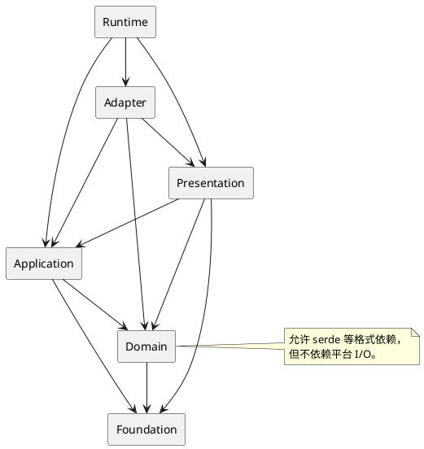

# 依赖规则与架构守卫

## 结论

目录层是当前架构的导航，不是编译器强制的规则。应把以下规则当作新增依赖的审查标准：依赖向内指向稳定模型，副作用停留在 adapter/runtime，表现层不触碰领域私有状态。遇到跨层需求时，优先新增显式 DTO、command、event 或 trait，而不是让上层穿透到深层实现。

## 目标依赖方向

这是目标方向，不表示每个箭头都应存在。例如 domain 不需要为了“分层完整”依赖 foundation，presentation 也不应直接依赖具体 adapter。

## 当前重要依赖

| 依赖 | 原因 | 判定 |
| --- | --- | --- |
| `game-session -> battle-session/world-application/game-data` | 产品状态组合战斗、世界和数据 | 合理 |
| `world-application -> map-project` | 把可编辑文档投影为可玩 world | 合理的翻译边界 |
| `game-ui -> game-session` | 将 input/计时输出为 `GameCommand` 并消费 snapshot | 可接受，但需保持只依赖公开 API |
| `game-view -> game-ui` | 需要 `PresentationSnapshot` 投影动画和菜单 | 可接受，必须单向 |
| `game-scene-view -> game-ui/game-session/map-render` | 组合当前场景 | 合理的只读 composition |
| `game-asset-plan -> game-session/game-ui/game-view` | 把可见场景所需资源转成请求 | 当前可接受，禁止加入文件 I/O |
| `map-editor-core -> punctum-gpu` | 编辑器工作台使用 viewport/像素布局模型 | 可接受，注意不引入 WGPU |
| `game-host -> 几乎全部游戏 crate` | 可执行组合根 | 合理，但不可反向被内层依赖 |

## 禁止或需要评审的依赖

| 新依赖 | 结论 | 替代方案 |
| --- | --- | --- |
| domain -> `winit`/`wgpu`/`crossterm`/`std::fs` | 禁止 | 在 adapter 定义翻译或 repository |
| application -> `game-native-target` | 禁止 | 返回 command/effect/view model |
| `game-view` -> `game-fs-assets` | 禁止 | 由 runtime 读取后提供 `NativeAssets`/资源键 |
| `map-project` -> `map-render` | 禁止 | renderer 依赖项目模型，不能反过来 |
| `game-session` -> `game-ui` | 禁止 | 通过 `GameEvent` 和 `GameSnapshot` 反馈 |
| `punctum-*` -> 任一游戏 crate | 禁止 | 向上移动泛型 trait 或新建基础模型 |
| runtime -> domain 私有字段 | 禁止 | 新增 observation/query API |
| presentation -> `Battle` 私有状态 | 禁止 | 使用 `BattleObservation` / `BattleSessionSnapshot` |

## 评审问题

新增 package 或依赖时，按顺序回答：

1. 它是否会读写文件、时钟、窗口、GPU、网络或进程环境？会，则从 adapter/runtime 开始设计。
2. 它是否定义业务不变量、版本格式或确定性规则？会，则放 domain。
3. 它是否跨多个领域对象执行业务命令或维护产品会话？会，则放 application。
4. 它是否把用户输入、逻辑时间或快照翻译为用户看到的内容？会，则放 presentation。
5. 它是否只是可复用的技术模型？会，则放 foundation。
6. 下游真正需要的是实现，还是一个 snapshot、event、command、asset key 或 trait？优先暴露后者。

## 可自动化的守卫

当前仓库已有 `scripts/test_pure_coverage.py`，但它只强制五个指定 crate 的生产行覆盖率：`punctum-grid`、`punctum-input`、`punctum-terminal`、`punctum-ui`、`game-asset-plan`。它不是通用的架构规则检查。

后续若要添加架构守卫，建议从低误报规则开始：

1. 用 `cargo metadata` 检查 foundation 不依赖业务层。
2. 扫描 domain/application 是否引入 `winit`、`wgpu`、`crossterm`、`std::fs`、`SystemTime`。
3. 检查 runtime 之外不直接创建 `NativeTarget` 或 Winit event loop。
4. 在 CI 运行 catalog 验证、workspace test、fmt、clippy 和选定 pure coverage。

这些应是增量约束。先把现有允许例外列出来，再让脚本失败；不要先设想完美分层后把当前可运行代码全部标红。
