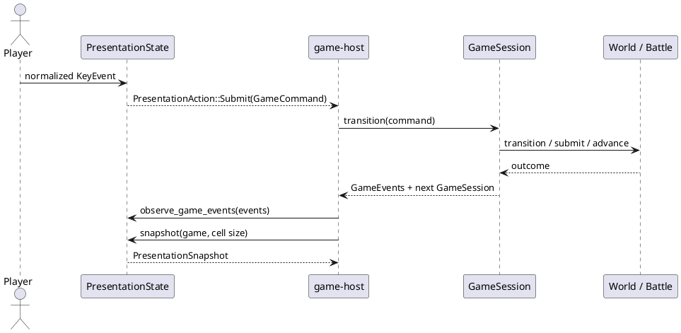
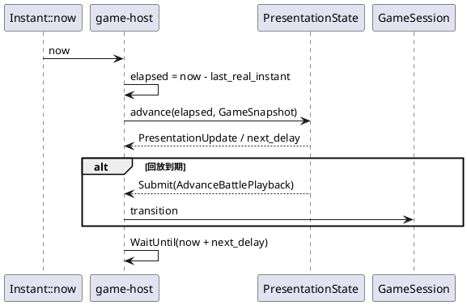

# 状态与时间

## 结论

项目已经形成一条清晰的游戏状态所有权链：`GameSession -> WorldApplication / BattleSession -> BattleApplication -> Battle`。表现状态不进入这条链，它由 `PresentationState` 单独持有并通过 `GameEvents` 同步。真实时间只在 `game-host`；可测试的逻辑时间只在 `game-ui`。这套结构应成为新增状态的默认模板。

## 状态分类

| 类别 | 当前所有者 | 生命周期 | 可否序列化 | 说明 |
| --- | --- | --- | --- | --- |
| 战斗规则状态 | `battle-domain::Battle` | 一场战斗 | 尚无正式格式 | 包含 RNG、队伍、回合与事件 |
| 可见战斗状态 | `BattleApplication` / `BattleSession` snapshot | 一场战斗 | 作为只读 DTO，不是正式存档 | 按观察方隐藏信息，拆成回放步骤 |
| 世界状态 | `world-domain::World` | 一次游戏会话 | 尚无正式格式 | 地图、位置、朝向 |
| 整局产品状态 | `GameSession` | 一次游戏会话 | 尚无正式格式 | scene、world、可选 battle、data、roster seed |
| 表现状态 | `PresentationState` | 窗口会话 | 不应作为核心存档 | 菜单、动画、按键、console、计时 |
| 编辑文档状态 | `MapProject` | 文件 + 编辑会话 | JSON 已实现 | 地图内容、格式版本、分层 cells |
| 编辑交互状态 | `EditorModel` + `EditorController` | 编辑器窗口 | 当前不持久化 | 选中工具、dirty、hover、历史、错误 |
| 平台状态 | `CreatureGameApp` / `MapEditorApp` | 进程 | 不应持久化 | window、GPU、修饰键、真实时钟 |

## 游戏状态交互

关键约束是单向：UI 能请求、能读取快照，但不能持有或改写 `GameSession`。host 临时 `take()` 并回填 `GameSession` 只是 Rust 所有权实现细节，不应被误解成 host 拥有玩法决策。

## 时间模型

`PresentationState` 使用 `Duration`，不调用 `Instant::now()`。目前的节奏包括世界 tick、转身/停跑保持、精灵帧和战斗回放。控制台打开时，表现计时暂停；玩法状态不会因为窗口等待而自行推进。

## 新状态的落点

| 新状态 | 建议所有者 | 原因 |
| --- | --- | --- |
| 玩家队伍、背包、金钱、徽章 | 新的产品级 session 子状态或明确的 player domain/application | 它们跨世界、战斗、商店和存档 |
| NPC 位置和对话进度 | world/session 状态，不是 `MapProject` | 地图文档是静态内容，运行时状态会变化 |
| 对话框开关、光标、文本动画 | `PresentationState` | 仅影响表现，不改变规则事实 |
| 任务完成条件 | domain + application | 规则可测试，需要接收世界/战斗事件 |
| 声音播放队列 | presentation event 或 effect | 与真实设备生命周期分离 |
| 文件保存状态 | application 的 save snapshot/effect + adapter | 不能被 window 或 UI 状态隐式控制 |

## 存档设计前提

当前没有 `SaveGame` 格式。实现前应先确定：

1. 存档只保留已结算的产品状态，不保存 `PresentationState`、窗口或 GPU。
2. 存档包含数据集版本、地图/世界版本、规则版本和必要 seed，防止数据升级后静默解释不同。
3. `GameSession` 的内部表示不能直接使用 serde 派生后冻结。应定义版本化 snapshot，并写迁移测试。
4. 战斗中存档需明确：保存完整战斗/RNG/回放队列，或只允许在已结算状态保存。两种策略的恢复语义不同。
5. 文件原子写入、备份和错误显示属于 adapter/runtime，不属于产品状态。

## 当前风险

- 新功能若在 `CreatureGameApp` 增加玩法字段，会绕开快照、事件和将来的存档边界。
- 新动画若在 host 维护独立 deadline，会再次形成与 `PresentationState::next_delay` 不同步的双时钟。
- `GameSession` 同时保存当前数据集和 roster seed，但还没有公开的“新游戏配置”对象。存档和可重放性需要先稳定这个输入边界。
