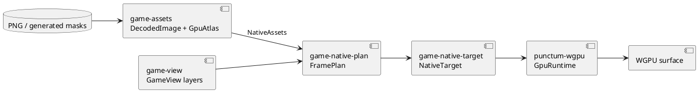
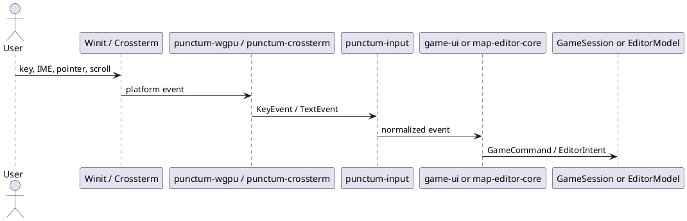

# 渲染与输入

## 结论

渲染路径已经从业务快照到原生提交分成四段：场景投影、语义视图、原生帧计划、WGPU target。输入也先标准化为 `punctum-input` 类型，再由 UI 或编辑器核心解释。这使平台替换与逻辑测试有明确边界。

## 渲染管线

### 每段的合同

| 段 | 输入 | 输出 | 应测试的内容 |
| --- | --- | --- | --- |
| 场景投影 | 游戏/表现快照、地图、viewport | `GameView` | 场景选择、layer 顺序、坐标和 asset key |
| 语义视图 | 业务观察、UI state | `ViewCell`、`ViewImage`、`TextLabel` | 角色位置、HP、菜单、文字内容 |
| 帧计划 | `GameView`、图集、viewport、文本比例 | `SubmissionPlan` + labels | 资源存在、surface 尺寸、clip、实例数量 |
| 原生 target | `FramePlan`、surface | `PresentOutcome` | resize、lost/timeout/occluded、文字 overlay |

`game-native-plan` 将 `ViewCell::Fill` 变为使用 `solid/white` 的矩形 `GpuCell::Sprite`，将图片转为 atlas image，将文字保留为 glyphon overlay。所以上游 canvas 是语义网格，不是任意矢量绘图 API。

## 图像与圆角

`game-asset-plan` 在运行时组装期间生成白色、圆角矩形和 pill 遮罩，并与文件中的 PNG 一起打进 `NativeAssets`。这条路径解决了“语义 cell 只能成为矩形”的限制。需要真正的曲线、透明边缘或特定按钮形状时，优先使用生成/导入的 alpha mask，或在 `punctum-gpu`/`game-native-plan` 引入经审查的新 primitive。

不要只在 `game-view` 用多格拼出圆角，然后期待 native 目标出现曲线。下游仍会把每一格作为矩形精灵提交。

## 输入管线

### 输入职责

| 组件 | 负责 | 不负责 |
| --- | --- | --- |
| 平台 adapter | Winit/Crossterm 事件转换、物理键和逻辑键保留 | 决定“P 是图鉴”或“方向键移动” |
| `punctum-input` | 键、修饰键、press/repeat/release、已提交文本类型 | IME 生命周期、业务快捷键 |
| `game-ui` | 控制台、图鉴、战斗菜单和移动操作解释 | 直接创建 Winit 窗口 |
| `map-editor-core` | 编辑器快捷键、指针按钮、滚轮到 `EditorIntent` | 写文件、画 GPU |
| runtime | 维护窗口 focus/IME allow、获取平台事件 | 藏起业务规则 |

当前游戏 runtime 用 Winit IME event 与 `normalize_committed_text`，当控制台打开才调用 `window.set_ime_allowed(true)`。这避免了把逻辑键字符误当作用户真正提交的文本。地图编辑器目前处理鼠标与滚轮，属于其专有交互路径。

## 扩展建议

| 需求 | 推荐路径 |
| --- | --- |
| 手柄 | adapter 输出统一动作或扩展 `punctum-input`；映射仍由 `game-ui` 管理 |
| 重绑定按键 | 新建可持久化 input mapping；`game-ui` 查询 mapping，平台 adapter 不知道偏好 |
| 触摸 | 新 adapter 将手势归一化；编辑器核心可定义新的 `EditorIntent` |
| 截图/视频 | 在 `game-native-target` 或外围 capture adapter 读取最终表面；不污染 `GameView` |
| 软件/终端渲染 | 新 runtime 消费 view/terminal plan；保持 game domain 与 UI command 不变 |
| 可访问性 | 在 view 产出语义 label 或单独 accessibility projection，不从 GPU 像素反推状态 |
