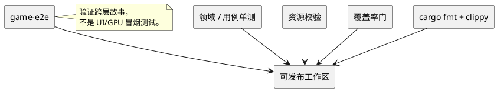

# 数据、资产与质量

## 结论

项目的质量策略已经有三类证据：领域/模块单测、跨层 `game-e2e` 故事测试、资源与覆盖率脚本。它们覆盖的风险不同，不能用任一类替代另一类。资产目录本身是受验证的数据产品，应和 Rust 代码一样纳入构建与发布检查。

## 质量入口

| 入口 | 覆盖目标 | 当前事实 |
| --- | --- | --- |
| Rust crate tests | 规则、转换、投影、错误边界 | 各 crate 内有单元与合同测试 |
| `game-e2e` | 世界进入战斗、确定性完成、战后返回位置 | 两个跨层故事测试，不启动窗口/GPU |
| `fixtures/battle-rules-v0.1.json` | 早期战斗语义与数值向量 | 当前与源码已漂移，不能作为完整范围基线 |
| `scripts/assets/verify_catalog.py` | 资产目录与 catalog 一致性 | 校验 key、source、hash、长度、PNG 尺寸、旧目录缺失 |
| `scripts/build_pokedex.py` | 图鉴索引与规范精灵一致性 | 重建 JSON/BIN 和 catalog lock |
| `scripts/test_pure_coverage.py` | 选定纯 crate 的生产行覆盖率 | 仅强制五个 crate 100% |

## 验证关系



## 现有覆盖率策略的准确含义

`scripts/test_pure_coverage.py` 的文件名和 docstring 指向“无状态、无副作用 crate”，但代码中写死的列表是：

- `crates/foundation/punctum-grid`
- `crates/foundation/punctum-input`
- `crates/foundation/punctum-terminal`
- `crates/foundation/punctum-ui`
- `crates/presentation/game-asset-plan`

它不会自动发现所有纯 crate，也不覆盖 `battle-domain`、`world-domain`、`game-data-import-core` 等。要扩大策略时，先对每个候选 crate 判断纯度和状态复杂度，再更新列表与文档；不要把“目录属于 domain”自动等同于“应该 100% 覆盖”。

## 推荐的本地检查顺序

```powershell
cargo fmt --all -- --check
cargo test --workspace
cargo clippy --workspace --all-targets -- -D warnings
python scripts/assets/verify_catalog.py
python scripts/test_pure_coverage.py
```

最后一项依赖 `cargo llvm-cov` 和会在 `target/` 写报告。若本机没有该工具，应将其视为环境缺失，而不是跳过其他四项。

## 新功能的测试矩阵

| 改动 | 最低测试 | 额外检查 |
| --- | --- | --- |
| 战斗规则 | `battle-domain` 向量、事件日志、非法动作 | 更新已批准 fixture，补 application 观察测试 |
| 新世界事件 | `map-project` 格式、`world-domain` 规则、`world-application` 投影 | `game-session` 场景切换、`game-e2e` 故事 |
| UI/动画 | `game-ui` 的 `Duration` 测试、`game-view` 投影测试 | `game-native-plan` 对资源和实例的检查 |
| 新资源 | catalog 验证、解码/尺寸测试 | LFS 可用性、asset plan 请求闭包 |
| 地图编辑器工具 | `map-editor-core` reducer/controller 测试 | view 投影、JSON round-trip、保存错误路径 |
| 新平台后端 | adapter 合同测试 | runtime 冒烟或手动平台测试 |

## 当前测试缺口

1. `battle-rules-v0.1.json` 声称禁用的特性、状态、天气、能力等级和招式效果已在 `battle-domain` 测试中出现。应补一份与源码同步的规则规范和向量，否则评审与回归基线不可靠。
2. `scripts/assets/verify_catalog.py` 当前失败：`data/game/current-dataset/v2` 的 catalog 长度和 SHA-256 与实际 `v2.json` 不同。该脚本在 catalog 重建前不能作为通过的质量证据。
3. `game-e2e` 覆盖玩法故事，但不覆盖窗口、真实 GPU 或真实文件树的完整启动。
4. 原生游戏有一个忽略的完整图集尺寸测试，因为已知背面精灵资源缺失。应把“资源缺口”与“渲染逻辑缺陷”分开追踪。
5. 地图项目虽有版本字段，但尚无跨版本迁移样本；一旦 `gen3-map-v1` 变化，应新增旧 JSON fixture 与迁移测试。
6. 导入器验证数据格式和固定 CSV 集，但尚无可复现的完整导入快照对比策略。数据来源升级时应记录 diff。
