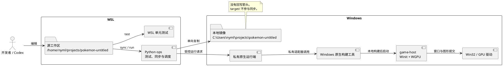
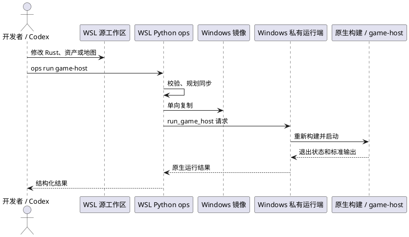
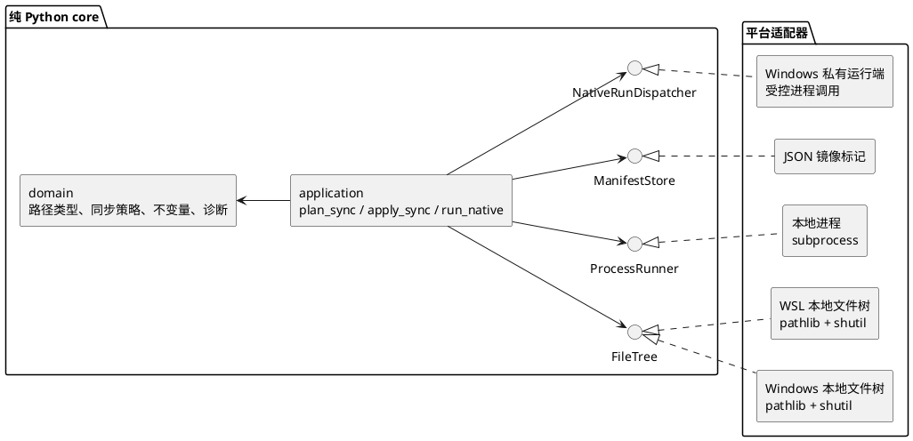

# WSL 开发与 Windows 原生运行工作流

## 状态

`game-host` 的 WSLg 运行限制和当前 Rust 代码依据是现状。`tools.pokemon_ops` 已有初始实现：它提供 WSL `check`、`doctor`、`format`、`test`、`sync`、`build game-host` 和 `run game-host`，以及 Windows 私有运行模块。Windows 原生构建与运行尚未在本 WSL 环境实际验收。

## 结论

代码以 WSL 工作区为唯一事实来源。Codex、编辑、文档和所有单元测试都在 WSL 进行。Windows 只在自己的本地镜像目录中重新构建并运行原生游戏。

不在 WSL 运行 `game-host`。它会创建 Winit 窗口、WGPU surface 和 GPU 提交链路。当前 WSLg 在这条链路上会崩溃，不能作为原生图形验收环境。

建议让同步、格式检查、测试、构建和运行只由一个纯标准库 Python ops 项目提供。用户、CI 和其他脚本只能在 WSL 调用 `ops`，不能直接调用 Rust 构建工具。WSL 开发者先进入 `nix develop`，由 Flake 将 `ops` 加入 `PATH`。`ops run game-host` 在 WSL 内同步镜像，再调度 Windows 私有运行端重新构建和启动。Windows 不提供给开发者手工调用的任务入口。ops 在每个宿主系统上选择对应的文件系统和进程适配器。项目不包含 PowerShell、批处理或平台专用脚本。

## 当前代码依据

`crates/runtime/game-host` 是原生组合根。它创建 Winit 窗口，调用 `NativeTarget::new`，并在每帧执行：

```text
GameSession -> project_scene -> FramePlan -> NativeTarget::present
```

`game-host` 还用 `env!("CARGO_MANIFEST_DIR")` 定位 `assets/` 和 `maps/`。因此，Windows 可执行文件应由 Windows 本地镜像目录编译。不要在 WSL 中交叉编译后把产物搬到 Windows 运行。

## 工作区与方向

| 位置 | 路径示例 | 负责内容 | 不负责内容 |
| --- | --- | --- | --- |
| WSL 源工作区 | `/home/nyml/projects/pokemon-untitled` | 代码、Codex、文档、资产编辑、所有单元测试、同步和运行调度 | 图形窗口、Windows 原生构建产物 |
| Windows 镜像 | `C:\\Users\\nyml\\projects\\pokemon-untitled` | 接收 WSL ops 的受控请求，重新构建、运行和 GPU 验收 | 编辑源代码、反向同步、手工测试或运行、保存长期源码状态 |

Windows 镜像是派生目录。只允许 WSL 源工作区覆盖它。Windows 侧的 `target/`、日志和崩溃产物不能回写到 WSL 源工作区。



## 目标日常流程

### 1. 在 WSL 修改源代码

所有编辑都落在 WSL 源工作区。资产、地图、Rust crate、文档和 ops 本身都在这里修改。

所有单元测试都在 WSL 完成。日常验证通过 ops 运行，例如：

```text
ops format --check
ops test --suite core
ops test --suite world
```

单元测试不会调度 Windows，也不依赖 Windows 镜像。最终的原生构建与窗口验收以 Windows 为准。

### 2. 在 WSL 执行 Python 同步

从源工作区执行：

```text
ops sync
```

该命令复制源码、`assets/`、`maps/`、文档和 ops 项目到 Windows 镜像。它跳过 `.git/`、`target/`、`.direnv/` 和本地编辑器缓存。

首次同步只允许目标镜像目录为空；ops 会先写入标记文件再复制。带删除的同步必须要求镜像根目录中有 ops 写入的标记文件。标记文件包含项目 ID 和源工作区 ID。未标记的非空目录或标记不匹配时，ops 必须拒绝复制和删除。

### 3. 在 WSL 调度 Windows 原生运行

从 WSL 源工作区执行：

```text
ops run game-host
```

该命令按固定顺序执行：校验源根和镜像标记，生成同步计划，复制到 Windows 镜像并删除镜像中已从源端删除的派生文件，再向 Windows 私有运行端发送 `run_game_host` 请求。Windows 运行端在镜像目录重新构建并启动 `game-host`。每次 `run` 都重新同步和构建，不提供跳过同步的参数。

WSL ops 通过本机配置的 Windows `python.exe` 直接调用镜像中的私有运行模块。它不经由 PowerShell、`cmd.exe` 或字符串形式的 shell 命令。适配器只传递结构化请求和明确的镜像工作目录。

### 4. 在 Windows 验收结果

验收窗口、输入、GPU 渲染、资源加载和崩溃日志。`ops run game-host` 在前台等待游戏退出，持续转发 Windows 输出，并返回游戏退出码。Windows 运行端把构建和运行结果返回给 WSL ops，由 WSL 输出结构化诊断。修复仍回到 WSL 源工作区完成，再次执行 `ops run game-host`。



## Python ops 初始实现

Python ops 不改变现有 Rust crate 依赖方向。

它位于工作区的 `tools/pokemon_ops/`。它是独立的 Python 源根，不加入 Rust workspace，不要求虚拟环境。

它必须提供 `ops` 命令入口。WSL 的 `flake.nix` 在 `nix develop` 中把该入口加入 `PATH`，因此开发者可在仓库根目录直接执行 `ops sync`、`ops check`、`ops test` 和 `ops run game-host`。Windows 镜像只安装供 WSL 调度的私有运行端，不提供开发者手工调用的命令。入口只负责将参数交给 `tools.pokemon_ops.cli`；命令含义、宿主判断和构建工具调用仍在 Python 项目内。

### 命令契约

`ops` 是唯一的任务入口。命令按任务意图命名，不暴露底层 Rust crate、构建器子命令或任意参数。所有命令支持 `--json` 输出机器可读结果；正常输出供开发者阅读。

| 命令 | 允许参数 | WSL 行为 | Windows 行为 | 写入或启动 |
| --- | --- | --- | --- | --- |
| `ops check` | 无 | 校验源根、配置和同步计划 | 不提供公开入口 | 不写入，不启动进程 |
| `ops doctor` | 无 | 报告 Python、Flake 开发环境、挂载镜像和 Windows 运行端可用性 | 不提供公开入口 | 不写入，不启动进程 |
| `ops format` | `--check` | 默认格式化 WSL 源树；`--check` 只报告差异 | 不提供公开入口 | 默认会修改源文件 |
| `ops test` | `--suite core|world|all` | 运行已定义的 WSL 单元测试；省略参数时运行 `all` | 不提供公开入口 | 启动受控测试进程，但不调度 Windows |
| `ops sync` | `--dry-run`、`--delete` | 从源根单向同步到 Windows 镜像 | 不提供公开入口 | 默认复制；`--delete` 仅删除有效标记镜像中的派生文件 |
| `ops build game-host` | `--profile debug|release` | 同步镜像并安全删除派生旧文件后，调度 Windows 重新构建固定目标 | 只处理 WSL 发送的构建请求 | 启动受控 Windows 构建进程 |
| `ops run game-host` | `--profile debug|release` | 同步镜像并安全删除派生旧文件后，调度 Windows 重新构建并启动固定目标 | 只处理 WSL 发送的运行请求 | 前台启动游戏，转发输出并返回退出码 |

`ops test --suite all` 运行所有已定义的 WSL 单元测试。它不访问 Windows 镜像，也不创建图形窗口。`ops build game-host` 和 `ops run game-host` 的目标固定为 `game-host`，`--profile` 省略时使用 `debug`。这保证用户不需要也不能通过 ops 传入底层构建器的包名、子命令或参数。

### 本机配置契约

WSL 在仓库根目录读取 Git 忽略的 `ops.local.json`。该文件保存本机路径和 suite 映射，不进入 Windows 同步计划。它至少包含以下信息：

```json
{
  "mirror": {
    "wsl_mount_root": "/mnt/c/Users/nyml/projects/pokemon-untitled",
    "windows_root": "C:\\Users\\nyml\\projects\\pokemon-untitled"
  },
  "windows_runner": {
    "python_executable": "/mnt/c/Users/nyml/AppData/Local/Programs/Python/Python313/python.exe",
    "module": "tools.pokemon_ops.native_runner"
  },
  "unit_suites": {
    "core": ["core"],
    "world": ["world"],
    "all": ["workspace"]
  }
}
```

`unit_suites` 的值是 ops 内部测试请求 ID，不是原生构建器的包名或参数。`ops doctor` 必须校验这些路径、Windows Python 和运行模块可用。路径或运行模块无效时，`ops run game-host` 在同步前返回结构化错误。

初版不提供 `ops exec`、反向 `sync`、无条件 `clean` 或任意进程执行。它们会绕过任务边界，或扩大误删和环境差异的风险。

```text
tools/pokemon_ops/
  __main__.py
  cli.py
  native_runner.py
  domain/
    config.py
    model.py
    policy.py
    errors.py
  application/
    sync_service.py
    testing_service.py
    native_service.py
  ports/
    interfaces.py
  adapters/
    local_config.py
    local_file_tree.py
    local_process_runner.py
    windows_native_run_dispatcher.py
  tests/
```

只使用 Python 标准库：`argparse`、`dataclasses`、`enum`、`json`、`os`、`pathlib`、`shutil`、`subprocess`、`sys`、`typing` 和 `unittest`。不引入同步库、CLI 框架或平台脚本。

### 分层职责

| 层 | 内容 | 禁止内容 |
| --- | --- | --- |
| `domain` | `SourceRoot`、`MirrorRoot`、`SyncPolicy`、`SyncPlan`、`TestSuite`、`BuildProfile`、`RunRequest`、错误码和不变量 | 文件读写、进程启动、平台判断 |
| `application` | 规划同步、校验安全条件、应用复制、运行 WSL 单元测试、调度 Windows 构建和原生运行 | `pathlib` 遍历、`subprocess` 调用 |
| `ports` | `FileTree`、`ProcessRunner`、`ManifestStore`、`NativeRunDispatcher` 的抽象 | 具体的 Windows 或 WSL API |
| `adapters` | 本地文件复制、JSON 标记、运行 WSL 测试、调度 Windows 私有运行端 | 业务规则和 CLI 输出格式 |
| `cli` | 解析命令、创建 adapter、打印结果和退出码 | 同步决策、删除规则 |



### 跨平台策略

ops 是 WSL 的唯一公开命令。它在需要渲染时通过 `NativeRunDispatcher` 调度 Windows 镜像中的私有运行端。该运行端只接受结构化的构建或运行请求，不能作为开发者的通用命令使用。

| 命令 | WSL 行为 | Windows 行为 |
| --- | --- | --- |
| `sync` | 源根到已配置 Windows 挂载镜像的单向复制 | 默认拒绝执行，避免把 Windows 目录当作源根 |
| `format` | 运行格式检查 | 拒绝执行，避免 Windows 镜像成为编辑入口 |
| `check` | 检查配置、源树和同步计划 | 不提供公开入口 |
| `doctor` | 报告开发环境、镜像挂载和 Windows 运行端可用性 | 不提供公开入口 |
| `test` | 运行 `core`、`world` 和 `all` WSL 单元测试 | 不提供公开入口 |
| `build game-host` | 同步后调度 Windows 重新构建固定目标 | 只处理 WSL 发送的构建请求 |
| `run game-host` | 同步后调度 Windows 重新构建并启动固定目标 | 只处理 WSL 发送的运行请求 |

宿主判断只放在 adapter 选择处，例如 `sys.platform` 和明确配置。领域对象不保存 `/mnt/c/...`、`C:\\...` 或任何平台命令字符串。配置同时保存两种根路径：WSL 源路径与 Windows 镜像路径；它们是不同类型，不能用一个裸字符串混用。

### 必须守住的不变量

1. 源根和镜像根必须存在，且不能相同、互为祖先目录或指向工作区根以外的危险位置。
2. 复制方向固定为 `SourceRoot -> MirrorRoot`。领域层不存在反向复制用例。
3. 删除只作用于带有效镜像标记的镜像根。未标记、项目 ID 不同或源 ID 不同都返回 `UnsafeMirror`。`build game-host` 和 `run game-host` 使用该规则删除已从源端删除的派生文件。
4. `.git/`、`target/`、`.direnv/` 和本地缓存始终不进入同步计划。
5. `RunRequest` 只表达已定义的操作，例如 `build_game_host` 和 `run_game_host`。它不能携带任意 shell 文本、目标名或构建参数。
6. `test` 只能使用 WSL `ProcessRunner`。它不能访问 Windows 镜像或 `NativeRunDispatcher`。
7. `run game-host` 和 `build game-host` 必须先完成同步计划、复制和受标记保护的删除。同步失败时不能调度 Windows 运行端；它们在 WSL 不创建 Winit 窗口或 WGPU surface。
8. `NativeRunDispatcher` 只能使用 `ops.local.json` 中配置的 Windows Python 和镜像工作目录启动私有运行模块。它不接受来自 CLI 的可执行路径、模块名或工作目录。
9. `run game-host` 必须在前台等待 Windows 运行端和游戏退出，转发标准输出与标准错误，并返回运行端返回的退出码。
10. Windows 私有运行端只接受来自 `NativeRunDispatcher` 的结构化请求，并且始终以 Windows 镜像目录为工作目录。
11. 文件复制和进程错误转换为结构化错误，例如 `InvalidConfiguration`、`SourceMissing`、`UnsafeMirror`、`CopyFailed`、`WindowsPythonUnavailable`、`WindowsRunnerUnavailable`、`BuildFailed`、`RunFailed`。

### 测试边界

`domain` 和 `application` 用 `unittest` 加内存或临时目录 adapter 测试。测试必须覆盖：路径冲突、错误标记、拒绝删除、排除规则、空变更计划、suite 映射、所有 unit suite 都使用 WSL runner，以及同步失败时不调度 Windows。

`adapters` 再用临时目录测试真实 `pathlib` 与 `shutil`。`LocalProcessRunner` 用 fake process runner 测试 WSL 单元测试的受控请求、参数列表与工作目录。`WindowsNativeRunDispatcher` 用 fake Windows 运行端测试配置的 Python 路径、请求内容、镜像工作目录、前台输出转发和退出码转换，不要求测试机安装原生构建工具或显卡驱动。

## 分阶段落地

| 阶段 | 交付物 | 完成标准 |
| --- | --- | --- |
| 1 | ops 目录、领域类型、本机配置解析、`check`、`doctor` 和同步计划 | 无效配置会被拒绝；可在临时目录证明不会把源与镜像混淆 |
| 2 | JSON 镜像标记、本地复制和 `sync --dry-run` | 标记不匹配时不删除；排除规则有测试 |
| 3 | WSL `format`、`test` 与 Windows 构建、运行调度 adapter | 所有单元测试在 WSL 完成；`ops run game-host` 先安全同步，再让 Windows 重新构建、前台启动并返回退出码 |
| 4 | 结构化 JSON 结果与失败日志位置 | CI 或人工能从错误码定位源、复制、构建或运行失败 |

第一阶段不自动删除文件。删除能力只在第二阶段、标记校验和测试完成后启用。

## 未来平台

macOS 和 Web 不改变领域和应用 crate 的方向。macOS 使用自己的本地工作区和同一套 Python ops 的本机 adapter。Web 需要新的 runtime 与资源 adapter，复用 `GameSession -> game-scene-view -> FramePlan` 之前先定义浏览器资源加载和呈现边界；不能把现有 `game-native-target` 当作 Web 后端。

## 不在本提案范围内

- 不修改 `game-session`、`game-scene-view`、`game-native-target` 或 `game-host` 的 crate 边界。
- 不把 WSLg 修复当作 Windows 原生运行的前置条件。
- 不启用双向同步、文件监听自动覆盖或未校验的递归删除。
- 不提供 Windows 侧的开发者 CLI、任意 Windows 命令执行或跳过同步的原生运行。
- 不新增 PowerShell、批处理、Shell 包装器或第三方 Python 依赖。
