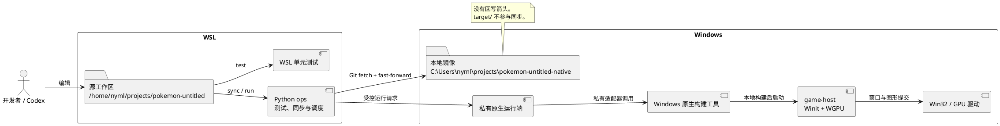
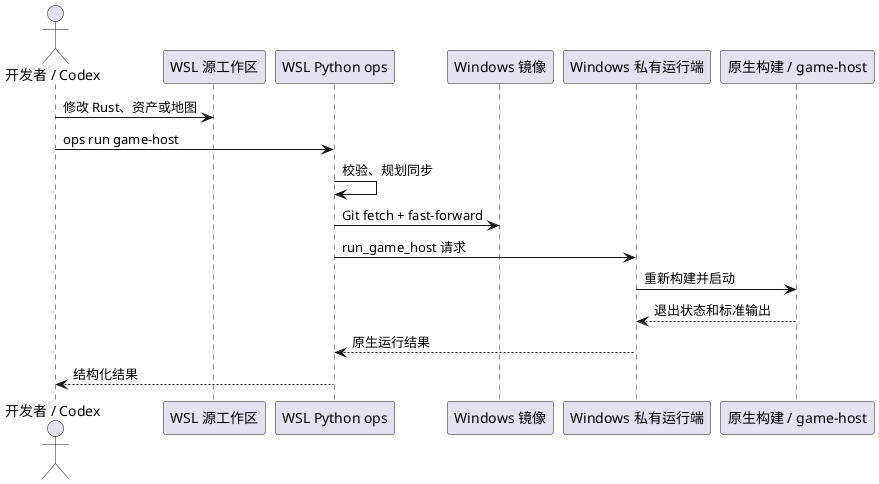
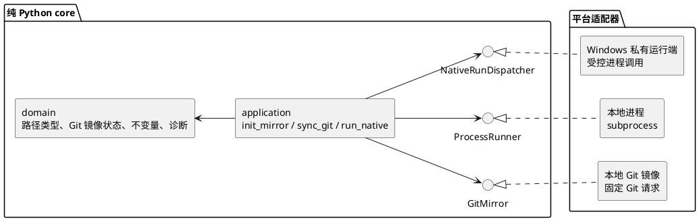

# WSL 开发与 Windows 原生运行工作流

## 状态

`game-host` 的 WSLg 运行限制和当前 Rust 代码依据是现状。`tools.pokemon_ops` 已有初始实现：它提供 WSL `check`、`doctor`、`format`、`test`、`sync`、`build game-host` 和 `run game-host`，以及 Windows 私有运行模块。Windows 原生构建与运行尚未在本 WSL 环境实际验收。

## 结论

代码、编辑、文档和所有单元测试都在 WSL 工作区进行。Windows 只在自己的 Git 镜像目录中重新构建并运行原生游戏。配置远端分支的当前提交是 Windows 原生验收的唯一版本契约。

不在 WSL 运行 `game-host`。它会创建 Winit 窗口、WGPU surface 和 GPU 提交链路。当前 WSLg 在这条链路上会崩溃，不能作为原生图形验收环境。

建议让同步、格式检查、测试、构建和运行只由一个纯标准库 Python ops 项目提供。用户、CI 和其他脚本只能在 WSL 调用 `ops`，不能直接调用 Rust 构建工具。WSL 开发者先进入 `nix develop`，由 Flake 将 `ops` 加入 `PATH`。`ops run game-host` 在 WSL 内同步镜像，再调度 Windows 私有运行端重新构建和启动。Windows 不提供给开发者手工调用的任务入口。ops 在每个宿主系统上选择对应的文件系统和进程适配器。项目不包含 PowerShell、批处理或平台专用脚本。

## 当前代码依据

`crates/runtime/game-host` 是原生组合根。它创建 Winit 窗口，调用 `NativeTarget::new`，并在每帧执行：

```text
GameSession -> project_scene -> FramePlan -> NativeTarget::present
```

`game-host` 还用 `env!("CARGO_MANIFEST_DIR")` 定位 `assets/` 和 `maps/`。因此，Windows 可执行文件应由 Windows 本地镜像目录编译。不要在 WSL 中交叉编译后把产物搬到 Windows 运行。

## 工作区与方向

| 位置 | 路径示例 | 负责内容 | 不负责内容 |
| --- | --- | --- | --- |
| WSL 源工作区 | `/home/nyml/projects/pokemon-untitled` | 代码、Codex、文档、资产编辑、所有单元测试、同步和运行调度 | 图形窗口、Windows 原生构建产物 |
| Windows 镜像 | `C:\\Users\\nyml\\projects\\pokemon-untitled-native` | 接收 WSL ops 的受控请求，重新构建、运行和 GPU 验收 | 编辑源代码、反向同步、手工测试或运行、保存长期源码状态 |

Windows 镜像是独立 Git 工作区。它只能 fast-forward 到配置远端分支。Windows 侧的 `target/`、日志和崩溃产物不能回写到 WSL 源工作区。



## 目标日常流程

### 1. 在 WSL 修改源代码

所有编辑都落在 WSL 源工作区。资产、地图、Rust crate、文档和 ops 本身都在这里修改。

所有单元测试都在 WSL 完成。日常验证通过 ops 运行，例如：

```text
ops format --check
ops test --suite core
ops test --suite world
```

单元测试不会调度 Windows，也不依赖 Windows 镜像。最终的原生构建与窗口验收以 Windows 为准。

### 2. 推送并更新 Git 镜像

首次使用时，先在 `ops.local.json` 配置新的空镜像目录，再执行：

```text
ops init-mirror
```

该命令从配置的远端和分支克隆 Git 镜像，并下载所需 Git LFS 对象。它不会覆盖非空目录。

日常开发先在 WSL 完成测试并推送提交。随后执行：

```text
ops sync
```

该命令获取配置的远端分支，并只允许镜像 fast-forward。未提交或未推送的 WSL 修改不会进入 Windows 镜像，也不会阻塞运行。镜像存在已跟踪修改、远端不匹配或分支分叉时，ops 必须拒绝继续。

### 3. 在 WSL 调度 Windows 原生运行

从 WSL 源工作区执行：

```text
ops run game-host
```

该命令按固定顺序执行：校验 Git 镜像，获取配置远端分支，fast-forward 到目标提交；只有 `.gitattributes` 或 LFS 指针变化时才更新 Git LFS 对象；随后向 Windows 私有运行端发送 `run_game_host` 请求。Windows 运行端在镜像目录重新构建并启动 `game-host`。每次 `run` 都重新同步和构建，不提供跳过同步的参数。

WSL ops 通过本机配置的 Windows `python.exe` 直接调用镜像中的私有运行模块。它不经由 PowerShell、`cmd.exe` 或字符串形式的 shell 命令。适配器只传递结构化请求和明确的镜像工作目录。

### 4. 在 Windows 验收结果

验收窗口、输入、GPU 渲染、资源加载和崩溃日志。`ops run game-host` 在前台等待游戏退出，持续转发 Windows 输出，并返回游戏退出码。Windows 运行端把构建和运行结果返回给 WSL ops，由 WSL 输出结构化诊断。修复仍回到 WSL 源工作区完成，再次执行 `ops run game-host`。



## Python ops 初始实现

Python ops 不改变现有 Rust crate 依赖方向。

它位于工作区的 `tools/pokemon_ops/`。它是独立的 Python 源根，不加入 Rust workspace，不要求虚拟环境。

它必须提供 `ops` 命令入口。WSL 的 `flake.nix` 在 `nix develop` 中把该入口加入 `PATH`，因此开发者可在仓库根目录直接执行 `ops sync`、`ops check`、`ops test` 和 `ops run game-host`。Windows 镜像只安装供 WSL 调度的私有运行端，不提供开发者手工调用的命令。入口只负责将参数交给 `tools.pokemon_ops.cli`；命令含义、宿主判断和构建工具调用仍在 Python 项目内。

### 命令契约

`ops` 是唯一的任务入口。命令按任务意图命名，不暴露底层 Rust crate、构建器子命令或任意参数。所有命令支持 `--json` 输出机器可读结果；正常输出供开发者阅读。

| 命令 | 允许参数 | WSL 行为 | Windows 行为 | 写入或启动 |
| --- | --- | --- | --- | --- |
| `ops check` | 无 | 校验源根、配置和同步计划 | 不提供公开入口 | 不写入，不启动进程 |
| `ops doctor` | 无 | 报告 Python、Flake 开发环境、挂载镜像和 Windows 运行端可用性 | 不提供公开入口 | 不写入，不启动进程 |
| `ops format` | `--check` | 默认格式化 WSL 源树；`--check` 只报告差异 | 不提供公开入口 | 默认会修改源文件 |
| `ops test` | `--suite core|world|all` | 运行已定义的 WSL 单元测试；省略参数时运行 `all` | 不提供公开入口 | 启动受控测试进程，但不调度 Windows |
| `ops init-mirror` | 无 | 只在配置的空目录中克隆固定远端与分支，并初始化 Git LFS | 不提供公开入口 | 创建 Git 镜像 |
| `ops sync` | 无 | 获取配置远端分支并 fast-forward Git 镜像；按需更新 LFS | 不提供公开入口 | 更新 Git 工作区，必要时更新 LFS 对象 |
| `ops build game-host` | `--profile debug|release` | Git 同步后调度 Windows 重新构建固定目标 | 只处理 WSL 发送的构建请求 | 启动受控 Windows 构建进程 |
| `ops run game-host` | `--profile debug|release` | Git 同步后调度 Windows 重新构建并启动固定目标 | 只处理 WSL 发送的运行请求 | 前台启动游戏，转发输出并返回退出码 |

`ops test --suite all` 运行所有已定义的 WSL 单元测试。它不访问 Windows 镜像，也不创建图形窗口。`ops build game-host` 和 `ops run game-host` 的目标固定为 `game-host`，`--profile` 省略时使用 `debug`。这保证用户不需要也不能通过 ops 传入底层构建器的包名、子命令或参数。

### 进度、JSON 与恢复

`init-mirror`、`sync`、`build` 和 `run` 会将阶段进度、Git、Git LFS 和 Windows 运行端输出持续写到标准错误。文本模式使用时间和阶段前缀。`--json` 模式将每条进度写成一行 JSON；标准输出只写最终的一个结果对象。

Git LFS 只在初始化、`.gitattributes` 变化或快进中新增、修改 LFS 指针时运行。没有远端变更或仅有普通源码变更时，`sync.lfs` 会明确报告跳过，不扫描全部 LFS 指针。

| 错误码 | 动作 |
| --- | --- |
| `MirrorMissing` | 配置新的空目录后运行 `ops init-mirror`。 |
| `MirrorDirty`、`MirrorDiverged` | 停止运行；人工处理镜像状态。ops 不自动 stash、clean、merge、rebase 或 reset。 |
| `GitLfsUnavailable`、`GitSyncFailed` | 保留阶段日志和最终错误，修复 Git、LFS、网络或远端状态后重新运行。 |
| `Cancelled` | 先运行 `ops check` 确认镜像提交，再决定是否重新同步。 |

### 本机配置契约

WSL 在仓库根目录读取 Git 忽略的 `ops.local.json`。该文件保存本机路径和 suite 映射，不进入 Windows 同步计划。它至少包含以下信息：

```json
{
  "mirror": {
    "wsl_mount_root": "/mnt/c/Users/nyml/projects/pokemon-untitled-native",
    "windows_root": "C:\\Users\\nyml\\projects\\pokemon-untitled-native",
    "remote": "origin",
    "branch": "master"
  },
  "windows_runner": {
    "python_executable": "/mnt/c/Users/nyml/AppData/Local/Programs/Python/Python313/python.exe",
    "module": "tools.pokemon_ops.native_runner"
  },
  "unit_suites": {
    "core": ["core"],
    "world": ["world"],
    "all": ["workspace"]
  }
}
```

`unit_suites` 的值是 ops 内部测试请求 ID，不是原生构建器的包名或参数。`ops doctor` 必须校验这些路径、Windows Python 和运行模块可用。路径或运行模块无效时，`ops run game-host` 在同步前返回结构化错误。

初版不提供 `ops exec`、反向 `sync`、无条件 `clean` 或任意进程执行。它们会绕过任务边界，或扩大误删和环境差异的风险。

```text
tools/pokemon_ops/
  __main__.py
  cli.py
  native_runner.py
  domain/
    config.py
    model.py
    errors.py
  application/
    sync_service.py
    testing_service.py
    native_service.py
  ports/
    interfaces.py
  adapters/
    local_config.py
    local_git_mirror.py
    local_process_runner.py
    progress_reporters.py
    streaming_process.py
    windows_native_run_dispatcher.py
  tests/
```

只使用 Python 标准库：`argparse`、`dataclasses`、`enum`、`json`、`os`、`pathlib`、`shutil`、`subprocess`、`sys`、`typing` 和 `unittest`。不引入同步库、CLI 框架或平台脚本。

### 分层职责

| 层 | 内容 | 禁止内容 |
| --- | --- | --- |
| `domain` | `SourceRoot`、`MirrorRoot`、Git 镜像配置与版本状态、`TestSuite`、`BuildProfile`、`RunRequest`、错误码和不变量 | 文件读写、进程启动、平台判断 |
| `application` | 初始化和校验 Git 镜像、运行 WSL 单元测试、调度 Windows 构建和原生运行 | `pathlib` 遍历、`subprocess` 调用 |
| `ports` | `GitMirror`、`ProcessRunner`、`NativeRunDispatcher` 的抽象 | 具体的 Windows 或 WSL API |
| `adapters` | 本地 Git 镜像、运行 WSL 测试、调度 Windows 私有运行端 | 业务规则和 CLI 输出格式 |
| `cli` | 解析命令、创建 adapter、打印结果和退出码 | Git 同步决策 |



### 跨平台策略

ops 是 WSL 的唯一公开命令。它在需要渲染时通过 `NativeRunDispatcher` 调度 Windows 镜像中的私有运行端。该运行端只接受结构化的构建或运行请求，不能作为开发者的通用命令使用。

| 命令 | WSL 行为 | Windows 行为 |
| --- | --- | --- |
| `init-mirror` | 在新的空目录中克隆固定远端分支 | 不提供公开入口 |
| `sync` | 获取固定远端分支并 fast-forward Git 镜像 | 不提供公开入口 |
| `format` | 运行格式检查 | 拒绝执行，避免 Windows 镜像成为编辑入口 |
| `check` | 检查配置、源树和同步计划 | 不提供公开入口 |
| `doctor` | 报告开发环境、镜像挂载和 Windows 运行端可用性 | 不提供公开入口 |
| `test` | 运行 `core`、`world` 和 `all` WSL 单元测试 | 不提供公开入口 |
| `build game-host` | 同步后调度 Windows 重新构建固定目标 | 只处理 WSL 发送的构建请求 |
| `run game-host` | 同步后调度 Windows 重新构建并启动固定目标 | 只处理 WSL 发送的运行请求 |

宿主判断只放在 adapter 选择处，例如 `sys.platform` 和明确配置。领域对象不保存 `/mnt/c/...`、`C:\\...` 或任何平台命令字符串。配置同时保存两种根路径：WSL 源路径与 Windows 镜像路径；它们是不同类型，不能用一个裸字符串混用。

### 必须守住的不变量

1. 源根和镜像根不能相同或相互嵌套。`ops init-mirror` 只接受不存在或为空的镜像目录。
2. Git 镜像的远端和分支必须分别匹配 `ops.local.json` 与 WSL 源工作区的配置远端。
3. Windows 镜像只能 fast-forward 到配置远端分支。它不自动合并、变基、暂存、清理或回退。
4. 镜像中的已跟踪本地修改必须返回 `MirrorDirty`；远端发生分叉必须返回 `MirrorDiverged`。
5. WSL 工作树是否干净不影响 Windows 运行。Windows 只运行配置远端分支的当前提交。
6. `RunRequest` 只表达已定义的操作，例如 `build_game_host` 和 `run_game_host`。它不能携带任意 shell 文本、目标名或构建参数。
7. `test` 只能使用 WSL `ProcessRunner`。它不能访问 Windows 镜像或 `NativeRunDispatcher`。
8. `run game-host` 和 `build game-host` 必须先完成 Git 同步；LFS 只在初始化、`.gitattributes` 或 LFS 指针变化时更新。同步失败时不能调度 Windows 运行端；它们在 WSL 不创建 Winit 窗口或 WGPU surface。
9. `NativeRunDispatcher` 只能使用 `ops.local.json` 中配置的 Windows Python 和镜像工作目录启动私有运行模块。它不接受来自 CLI 的可执行路径、模块名或工作目录。
10. `run game-host` 必须在前台等待 Windows 运行端和游戏退出，转发标准输出与标准错误，并返回运行端返回的退出码。
11. Windows 私有运行端只接受来自 `NativeRunDispatcher` 的结构化请求，并且始终以 Windows 镜像目录为工作目录。
12. Git 和运行端错误必须转换为结构化错误，例如 `MirrorMissing`、`UnsafeMirror`、`GitRemoteUnavailable`、`GitLfsUnavailable`、`MirrorDirty`、`MirrorDiverged`、`BuildFailed`、`RunFailed`。

### 测试边界

`domain` 和 `application` 用 `unittest` 加临时 Git 仓库测试。测试必须覆盖：空镜像初始化、已同步提交、fast-forward、镜像脏、镜像分叉、远端或分支不匹配、普通源码快进跳过 LFS、LFS 指针变更检测、suite 映射、所有 unit suite 都使用 WSL runner，以及同步失败时不调度 Windows。

`adapters` 再用临时 bare 仓库测试真实 Git 初始化和 fast-forward。`LocalProcessRunner` 用 fake process runner 测试 WSL 单元测试的受控请求、参数列表与工作目录。`WindowsNativeRunDispatcher` 用 fake Windows 运行端测试配置的 Python 路径、请求内容、镜像工作目录、前台输出转发和退出码转换，不要求测试机安装原生构建工具或显卡驱动。

## 分阶段落地

| 阶段 | 交付物 | 完成标准 |
| --- | --- | --- |
| 1 | ops 目录、领域类型、本机配置解析和 Git 镜像状态 | 无效配置会被拒绝；可在临时仓库证明不会把源与镜像混淆 |
| 2 | 显式 `init-mirror`、Git fast-forward、按需 Git LFS 与进度事件 | 非空目录、脏镜像和分叉都会被拒绝；普通源码同步不扫描全部 LFS 指针；不覆盖目录 |
| 3 | WSL `format`、`test` 与 Windows 构建、运行调度 adapter | 所有单元测试在 WSL 完成；`ops run game-host` 先安全同步，再让 Windows 重新构建、前台启动并返回退出码 |
| 4 | 结构化 JSON 结果与失败日志位置 | CI 或人工能从错误码定位 Git、构建或运行失败 |

## 未来平台

macOS 和 Web 不改变领域和应用 crate 的方向。macOS 使用自己的本地工作区和同一套 Python ops 的本机 adapter。Web 需要新的 runtime 与资源 adapter，复用 `GameSession -> game-scene-view -> FramePlan` 之前先定义浏览器资源加载和呈现边界；不能把现有 `game-native-target` 当作 Web 后端。

## 不在本提案范围内

- 不修改 `game-session`、`game-scene-view`、`game-native-target` 或 `game-host` 的 crate 边界。
- 不把 WSLg 修复当作 Windows 原生运行的前置条件。
- 不启用双向同步、文件监听自动覆盖或未校验的递归删除。
- 不提供 Windows 侧的开发者 CLI、任意 Windows 命令执行或跳过同步的原生运行。
- 不新增 PowerShell、批处理、Shell 包装器或第三方 Python 依赖。
