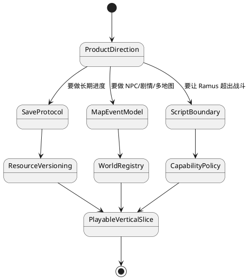

# 风险与架构债务

## 结论

当前架构最大的风险不是目录名称，而是产品边界尚未被未来需求选择：存档、一般地图事件、可配置遭遇、脚本范围和发布目标都还没有正式模型。应优先解决会改变数据协议和状态所有权的问题；视觉或代码整理可以在这些边界稳定后迭代。

## 按优先级排序

| 优先级 | 风险 | 证据 | 后果 | 建议动作 |
| --- | --- | --- | --- | --- |
| 高 | 没有正式存档/版本协议 | `GameSession`、战斗和数据集均无 save schema | 新增长期进度后难以迁移和复现 | 在加入背包/任务前定义版本化产品 snapshot |
| 高 | 地图事件只有 `Encounter` | `MapEventKind` 仅一项，世界投影只识别草地 | NPC、传送、剧情会走临时特判 | 先设计带参数的事件和执行边界 |
| 高 | 演示队伍与产品配置混合 | `GameSession` 内部按 data + seed 创建 demo teams | 训练师、野生、玩家长期队伍难以落位 | 建立新游戏/遭遇配置模型 |
| 高 | 战斗规则 fixture 已与源码漂移 | `v0.1` 禁用的特性、状态、天气等已有源码测试 | 评审、回归与产品承诺会相互矛盾 | 更新或版本化规则规范和数值向量 |
| 中 | 资产与地图缺少共同 bundle 版本 | `MapProject` 不引用 catalog 或 bundle 版本 | 资源重命名/删除会让旧地图失效 | 在项目/存档引入资产集版本与迁移策略 |
| 中 | 当前 asset catalog 与源数据失配 | `data/game/current-dataset/v2` 的长度和 SHA-256 不同 | catalog 验证与依赖它的 CI 门禁不能通过 | 重建或修正 catalog 与 lock，并锁定生成顺序 |
| 中 | 原生 host 可能变成万能容器 | host 已持有状态、资源、窗口、时间和组装 | 音频/存档/网络继续堆入 host | 用 effect + adapter 扩展，保持玩法状态在 core |
| 中 | 完整图集已知资源缺口 | game host 有 ignored atlas test | 发布时可能遇到未覆盖路径 | 在 CI 前关闭缺口或将资源集合缩小为显式清单 |
| 低 | 终端后端未接入实际产品 | `punctum-crossterm` 有 adapter，无 runtime 装配 | 维护成本不明 | 决定保留为实验/调试还是建立运行入口 |
| 低 | 层规则主要靠约定 | 未发现自动 architecture gate | 依赖会逐步回流 | 先加低误报 cargo metadata 守卫 |

## 不建议立即做的事情

1. 不要仅为“六层整齐”拆分更多 crate。当前已有足够细的 package 边界，功能目标比再拆一层更紧急。
2. 不要把模型类型本身当作实现证据，但也不要用已过期的 v0.1 fixture 否定已存在的执行路径。两者冲突时以源码测试为当前事实，并补规范。
3. 不要将 `EditorEffect` 改成核心直接写文件以追求“代码少”。当前外围执行效果的界线是未来自动保存和云同步的基础。
4. 不要为可能的 Web、终端、移动端同时抽象所有 API。先选择一个明确的第二发布目标，用它检验 `GameView` 和 adapter 边界。

## 推荐缓解顺序

这个顺序不是要求一次性完成所有项。它说明先后关系：一旦功能需要持久化或跨地图，必须先稳定相应数据协议；否则后续重构成本会迅速上升。
