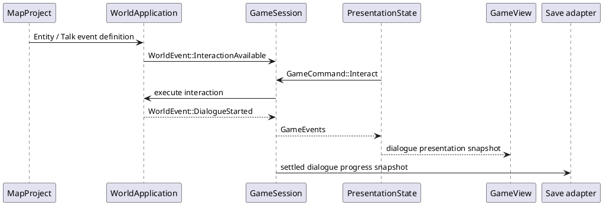

# 扩展点与功能落位

## 结论

项目当前最可复用的扩展点是：`GameCommand/GameEvent/GameSnapshot` 产品边界、`OpponentPolicy`、`MapEventKind`、`EditorEffect`、`AssetKey/AssetCatalog`、`GameView/FramePlan` 和 Ramus `Provider`。新能力应先选择其中一个明确入口；没有合适入口时，再新建小而稳定的领域模型或端口。

## 功能落位表

| 目标功能 | 领域/应用 | 表现 | 外围 | 需要先决定 |
| --- | --- | --- | --- | --- |
| 玩家队伍、背包、金钱 | player domain + 产品 session | 菜单、HUD | save adapter | 物品 ID、存档版本、战斗消费规则 |
| 野生遭遇和训练师 | encounter/roster 配置 + `OpponentPolicy` | 战斗入场展示 | 数据加载 | 遭遇表、队伍来源、seed 语义 |
| NPC 与对话 | map entity/event + world application | 对话/角色投影 | 文本资源和存档 | 实体 ID、触发模型、阻挡规则 |
| 多地图与传送 | world registry + event execution | loading/transition | map repository | 地图 ID、坐标、连接与版本 |
| 任务/成就 | quest domain + event subscriber | 任务 UI | save adapter | 事件协议、完成条件、奖励幂等 |
| 存档/读档 | versioned product snapshot + use case | 槽位 UI、错误提示 | filesystem adapter | 格式、迁移、原子性、失败恢复 |
| 战斗机制扩展 | `battle-domain` | 回放 cue、HUD | 无需先加新 I/O | 同步的规则规范、事件顺序、可见性 |
| 脚本化事件 | 明确 event provider + capability policy | 控制台/调试 UI | Ramus adapter | 脚本是否可信、权限、热更新 |
| 音频 | 由 events/cues 驱动 | 音量/设置 UI | audio adapter | cue 稳定性、重复/取消语义 |
| 新图形平台 | 不改变 domain/application | 复用 view/plan | 新 target/runtime | 是否复用现有 GPU IR |

## 典型新增垂直切片：NPC 对话

这条切片需要新类型，但每个类型的家很明确：静态内容进地图项目，运行时规则进世界/应用，场景调度进游戏会话，分页与动画进 UI，显示进 view，持久化进 save adapter。

## 何时新增 crate

满足至少一项时再新增 crate：

1. 有独立的业务语言和不变量，例如 `quest-domain`。
2. 有独立的外部协议或平台依赖，例如 `game-save-fs`、`game-audio-rodio`。
3. 现有 crate 同时承担两种无法一起测试或发布的职责。
4. 新模块可被两个以上上层消费者复用，并能暴露稳定的小 API。

否则优先在既有所有者中增加模块。比如一项新的战斗动画通常只需要扩展 `BattleCue`、`PresentationState` 和 `game-view`，不需要创建 `battle-animation` crate。

## 端口优先的扩展方式

| 需求 | 先定义什么 | adapter 最后实现什么 |
| --- | --- | --- |
| 存档 | `SaveGame` snapshot、load/save use case 和错误模型 | 本地文件、云端、加密 |
| 地图仓库 | map ID 到 validated project 的查询接口 | 文件树、压缩包、远程内容 |
| 音频 | 业务/表现 cue 的稳定枚举 | 播放器、缓存、设备错误 |
| 网络对战 | command/event wire format、版本协商 | WebSocket/UDP、重连 |
| 本地化 | 文本 key 与参数模型 | bundle 文件、语言选择 |

接口应由消费者真正需要的语义驱动。不要把 `std::fs::File`、WGPU handle 或 CSV reader 穿过 application 边界，以免把某个部署选择固化为游戏核心协议。
