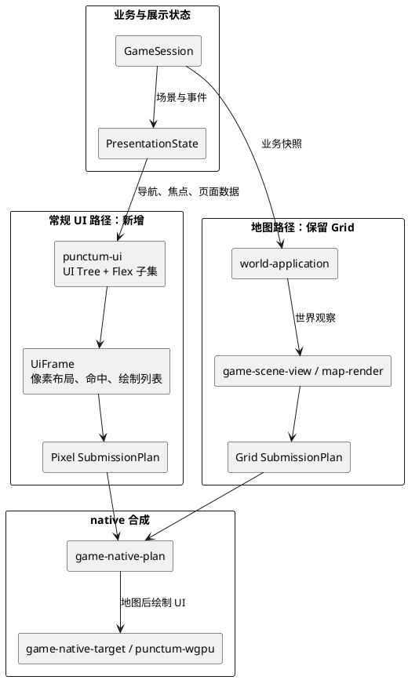

# Flex UI 布局与 GPU 渲染改造方案

> 状态：已采纳，第二阶段实施中
> 日期：2026-07-16
> 范围：大世界 UI 的布局与渲染边界。大地图和地图编辑器保留 Grid；所有游戏运行时页面与覆盖层使用 Pixel UI。

## 结论

新建 foundation crate `punctum-ui`。它负责 UI 树、受限 Flex 布局、布局结果、绘制列表和命中区域。

`punctum-ui` 的布局计算必须是纯 Rust 逻辑。它不直接依赖 `wgpu`、窗口、输入设备或游戏状态。

同时扩展 `punctum-gpu`，使其能提交像素坐标的 UI 四边形和图片。裁剪区域先保留在 UI 绘制命令中，逐命令 GPU scissor 是下一阶段工作。不能只增加 Flex crate，因为现有 `punctum-gpu` 的图像和提交模型本身仍以 Grid 为中心。

地图继续使用 Grid。大世界 UI、图鉴、背包、队伍、经济、势力和情报页面使用新 UI 模型。两个模型在 native plan 和 GPU adapter 中按层组合。

首个迁移对象是图鉴页面。它已经使用新 UI 树重建，验证了布局、文字、图片、命中区域和键盘焦点；地图和对战仍使用原有路径。

## 当前实现

| 项目 | 当前实现 |
| --- | --- |
| `punctum-ui` | 纯 Rust 像素 UI 树。提供 `UiSize`、`UiRect`、`UiColor`、`UiId`、`UiTree`、受限行列 Flex、叠放、内边距、对齐、裁剪绘制命令和最上层命中测试。它不依赖 Grid、GPU、窗口或游戏状态。 |
| `punctum-gpu` | 提供 `GpuPixelImage` 和 `plan_pixels`。像素矩形直接生成实例计划，不分配 Grid `Surface`。现有 shader 使用一个像素一个逻辑单元的 viewport，因此复用图集、颜色和实例编码。 |
| `game-native-plan` | 提供 `FramePlan::from_ui_frame`。它是内容 ID 到资源 ID、UI 颜色到 GPU 颜色、UI 文字到 native 标签的唯一转换边界。 |
| 图鉴 | `game-view::project_pokedex` 返回 `UiTree`，`game-scene-view` 将它解析为 `SceneFrame::Ui`，`game-host` 再走 `FramePlan::from_ui_frame`。图鉴不再创建固定 32×24 的 `GameView` 或 `Surface`。 |

当前像素提交已经足以渲染全屏专注页面。第二阶段补齐盒子模型、圆角、像素批次和 Grid/Pixel 同帧合成，并迁移战斗与命令控制台。

页面迁移的硬性验收条件是视觉等价。Flex、盒子模型和圆角只能改善实现边界与缩放行为，不能改变现有页面的构图、层级、颜色或信息密度。实施细节见 [实施记录](001-flex-ui-layout-and-rendering-implementation-log.md)。

## 背景与问题

当前源码已经有可用的地图场景和独立的展示状态，但页面绘制被统一的 Grid 表示限制。

| 位置 | 当前职责 | 对 UI 改造的影响 |
| --- | --- | --- |
| `world-domain`、`world-application` | 地图移动、碰撞、遭遇和世界观察 | 地图的格子语义合理，应保留。 |
| `game-session` | `World` / `Battle` 场景切换和产品状态 | 应继续拥有业务状态，不拥有页面布局。 |
| `game-ui::PresentationState` | 输入、动画、战斗菜单、图鉴开关和控制台状态 | 应演进为 UI 导航与焦点状态的所有者。 |
| `game-view` | 把图鉴、对战和世界投影成 `GameView` | 当前文字、背景和图片位置都使用 Grid。 |
| `game-native-plan` | 把 `GameView` 转成 GPU 提交计划 | `FramePlan::from_game_view` 要求所有 Surface 共用一个 Grid 尺寸。 |
| `punctum-gpu` | 图集、视口、实例计划和字节编码 | `GpuImage` 使用 `GridRect`；`plan_composite` 需要 `Surface`。 |

地图、角色移动和瓦片适合 Grid。图鉴、市场、势力关系、新闻、背包和队伍管理不是地图，也不应该被伪装成固定格子画布。

继续在 `game-view` 中添加 Grid 坐标和 Canvas 绘制函数，会造成三个问题：

1. 每个新页面都要直接处理行列、像素跨度和固定画布尺寸。
2. 页面无法自然适配窗口尺寸、内容密度和后续交互复杂度。
3. UI 的布局规则、页面语义和 GPU 提交继续耦合，无法单独测试和演进。

## 目标

1. 保留地图 Grid 渲染，不重写已有地图、编辑器或瓦片逻辑。
2. 为常规游戏 UI 提供最小、确定性的 Flexbox 子集。
3. 让布局算法可在没有 GPU、窗口和资产文件时测试。
4. 支持面板、列表、图标、文本、遮罩、弹窗、裁剪和命中区域。
5. 保持 `GameSession` 的业务状态所有权和 `PresentationState` 的展示交互所有权。
6. 允许 Grid 地图与像素 UI 在同一帧按稳定层级组合。
7. 先用一页验证，再逐步迁移，不一次替换全部 UI。

## 非目标

- 不实现浏览器 CSS，不兼容选择器、级联、媒体查询或完整 Flexbox 规范。
- 不把 Flex 计算放进 GPU shader。
- 不引入直接依赖 `wgpu` 的布局 crate。
- 不重写对战规则、地图规则、存档或 Agent 系统。
- 不在第一阶段实现滚动惯性、虚拟列表、复杂文本排版或完整可访问性系统。
- 不强制迁移地图场景、地图编辑器或所有既有页面。

## 已采用的 UI 原则

### 大世界与页面关系

- 地图是探索时的默认场景。
- 地图之上的背包、队伍摘要和现场交互使用轻量覆盖层。
- 经济、势力、情报、图鉴和深度培育使用专注页面。
- 对战是独立场景，不是地图上继续堆叠的一张大页面。
- 专注页面一次只打开一个；确认弹窗只覆盖当前页面；关闭后直接回地图，不积累任意深度的页面栈。

### 世界时间与 UI

- 浏览 UI 不推进世界时间。
- 只有提交会改变世界的行动才推进离散世界时钟。
- Agent 的受控结果只在世界行动、地区结算或关键节点检查等明确结算点应用。
- UI 不能因为阅读、切换页面或等待真实时间而让 NPC 在后台任意变化。

## 目标架构



地图和 UI 不共享布局抽象，但共享同一个最终帧。地图先画，UI 后画。UI 可以用透明遮罩、面板或弹窗覆盖地图；地图不需要知道 UI 的 Flex 树。

## 新 crate：`punctum-ui`

### 位置与依赖

位置：`crates/foundation/punctum-ui`。

它是一个纯计划 crate。第一版只依赖 Rust 标准库，不持有 GPU device、窗口句柄、事件循环、输入设备或 `punctum-gpu` 类型。

`punctum-ui` 自己定义 `UiSize`、`UiRect`、`UiColor` 和内容 ID。`game-native-plan` 是唯一把 `UiFrame` 映射为 `punctum-gpu::PixelRect`、`ResourceId` 和 GPU 命令的边界。这样布局核心不会经由 `punctum-gpu` 间接重新依赖 Grid，也不会知道图集资源如何解析。

### 对外模型

`punctum-ui` 需要提供以下概念，名称可在实现时微调：

| 概念 | 职责 |
| --- | --- |
| `UiId` | 节点的稳定类型安全标识。不同页面和命中区域不使用裸整数或字符串混传。 |
| `UiTree` | 有且仅有一个根节点的 UI 树。构造时拒绝重复 `UiId`。 |
| `UiNode` | 样式、内容、子节点和可选交互语义。外部不能直接破坏树关系。 |
| `UiStyle` | Flex 子集、尺寸、间距、对齐、定位、可见性和裁剪规则。 |
| `UiSize`、`UiRect`、`UiColor` | 与渲染后端无关的像素几何和颜色值。 |
| `UiContentId` | 图片、图标或文字内容的类型安全引用；资源解析留在边界层。 |
| `UiFrame` | 对给定 viewport 解析后的像素矩形、绘制顺序、裁剪区域和命中区域。 |
| `UiDrawCommand` | 使用 `UiRect` 与 `UiContentId` 的填充、图片、文字、推入裁剪、弹出裁剪等渲染无关指令。 |
| `UiHitRegion` | 从布局结果导出的命中矩形与 `UiId`，供输入层使用。 |

调用形态应保持单向：

```text
页面数据 + UiTree + viewport + 内容固有尺寸
    -> resolve_layout(...)
    -> UiFrame
    -> GPU 计划 / 输入命中测试
```

文字的字体测量不进入布局引擎。调用方在构建树时提供文字、图标和图片的固有尺寸，或通过明确的测量能力生成这些尺寸。这样 `punctum-ui` 不需要依赖字体文件、窗口 DPI 或平台文本 API。

### Flex 子集

第一版只实现游戏 UI 必需能力：

| 类别 | 第一版支持 |
| --- | --- |
| 容器 | `row`、`column`、叠放容器 |
| 尺寸 | 固定像素、内容固有尺寸、剩余空间分配、最小值、最大值 |
| 间距 | 内边距、外边距、`gap` |
| 主轴对齐 | 起点、居中、末端、均匀分布 |
| 交叉轴对齐 | 起点、居中、末端、拉伸 |
| 覆盖 | 绝对定位，用于 HUD、遮罩、弹窗和角标 |
| 裁剪 | 矩形裁剪。滚动区域以后在此基础上增加。 |
| 命中 | 按绘制层级返回最上层可交互 `UiId` |

第一版明确不支持：自动换行、负边距、基线排版、CSS 百分比兼容、选择器、样式继承和浏览器级别的溢出策略。

### 盒子模型与圆角

`UiStyle` 使用确定性的 border-box 模型。`width` 和 `height` 表示节点外框。布局先从外框扣除 `border` 和 `padding`，子节点只在剩余的 content box 内排布。

| 字段 | 含义 |
| --- | --- |
| `margin` | 节点与相邻 flow 节点之间的外边距。它参与父容器的主轴空间计算。 |
| `border` | 四边的像素宽度和颜色。它占用外框空间。 |
| `padding` | 内容区与边框之间的内边距。它占用外框空间。 |
| `border_radius` | 四个角的像素半径。它不改变外框尺寸，不参与 Flex 分配。 |

圆角由 `UiDrawCommand` 显式携带。`game-native-plan` 把圆角填充映射到白色圆角遮罩，把圆角图片映射到相同的遮罩路径；布局 crate 不知道图集或 shader。半径必须被限制为外框短边的一半。命中区域和子树裁剪使用圆角的外接矩形；精确曲线命中不是第一阶段目标。

### 不变量与错误

布局树的正常失败必须以结构化 `Result` 返回。当前版本至少区分：

- 重复 `UiId`。
- 布局空间不足。

当前实现使用递归节点模型，因此没有“根缺失”“子节点引用不存在”“环”或“多个父节点”这类外部输入形态。若未来改为节点表和引用关系，必须补充这些错误分类和测试。

无效外部输入不能通过 `panic!` 处理。`panic!` 只用于 crate 内部不变量已经被构造器保证却仍被破坏的编程错误。

## `punctum-gpu` 的演进

### 保留当前 Grid 提交模型

`Surface<GpuCell>`、`GpuImage`、`SubmissionPlan`、`plan_surface`、`plan_patch` 和 `plan_composite` 继续服务地图、终端和已有 Grid 内容。它们不是新 UI 的兼容层。

### 新增像素提交模型

新增像素路径，避免为了 UI 破坏已有 Grid API：

| 新概念 | 用途 |
| --- | --- |
| `GpuPixelImage` | 使用 `PixelRect` 表示目标区域，而非 `GridRect`。已实现。 |
| `plan_pixels` | 将已经解析资源的像素绘制项映射为实例计划。已实现。 |
| `PixelClip` | 以屏幕像素矩形定义裁剪区域。待与每命令 scissor 批次一起实现。 |
| `PixelSubmissionPlan` | 像素四边形、绘制顺序、scissor 和实例上传计划。待在 Grid/像素同帧合成阶段从现有计划中拆出。 |

当前 `plan_pixels` 复用实例计划和 shader，但不分配 `Surface`。在同帧合成阶段必须拆出 `PixelSubmissionPlan`，避免给 Grid 计划加入无意义的可选字段，也避免把一个像素当作一个 Grid cell。

当前全屏 UI 页面复用现有 native adapter 和 shader。后续同帧合成需要让 `punctum-wgpu` 支持 Grid 实例和像素实例顺序提交；两者可以共用图集、颜色、GPU 生命周期和帧同步。

## `game-native-plan` 与展示层迁移

`game-native-plan` 不再假设一帧只有一张共享尺寸的 Grid Surface。目标是一个组合帧：

```text
NativeFramePlan
|- grid_layers: 现有地图和像素风 Grid 内容
|- ui_layers: UiFrame 转换出的 PixelSubmissionPlan
`- text_layers: 按 UI 像素矩形定位的文字计划
```

文字目前由 native plan 的标签路径处理。迁移后文字需要使用像素矩形、字体大小和裁剪区域，而不是 `col`、`row`、`width`、`height`。这项改造与 Flex 布局同属 UI 路径，不应反向污染地图文字。

`game-ui::PresentationState` 保持为 UI 导航、焦点和瞬态动画的所有者。它将逐步从单独的 `pokedex: Option<_>` 演进为受限的导航状态：

```text
World UI
|- Context overlay: None | Backpack | PartySummary | Interaction
|- Focus page: None | Pokedex | PartyDetail | Economy | Faction | Intelligence
`- Modal: None | Confirm(...)
```

这不是业务状态。金钱、队伍、势力和世界事实仍属于各自的 `GameSession` 或未来应用层快照。UI 只保存当前显示什么、哪个节点获得焦点、以及尚未提交的输入。

## 迁移步骤

### 1. 先扩展像素 GPU 计划（完成）

在不修改 `game-view` 页面逻辑的前提下，为 `punctum-gpu` 和 native adapter 增加像素矩形实例、裁剪和提交测试。

完成标准：一个无 Grid Surface 的纯像素矩形和图像帧能被计划、编码并在 native target 绘制；现有 Grid 测试保持通过。已由 `plan_pixels` 和 `FramePlan::from_ui_frame` 覆盖。

### 2. 创建 `punctum-ui` 并验证布局核心（完成）

创建 `UiTree`、Flex 子集、`UiFrame`、绘制列表和命中测试。只用 fixture 和内存数据测试，不启动 GPU。

完成标准：行、列、剩余空间分配、最小/最大尺寸、间距、对齐、绝对覆盖、裁剪和最上层命中都有确定性测试；无效树返回结构化错误。

### 3. 图鉴作为首个专注页面（完成）

用 `punctum-ui` 重建现有图鉴页面。保留现有数据源和导航行为，不重写业务规则。

完成标准：图鉴不再依赖固定 Grid Canvas；窗口尺寸变化不会依赖人工行列坐标；键盘导航、文字、图片和返回地图仍可用。图鉴的 UI 状态仍由 `PresentationState::pokedex` 保存，关闭行为没有变化。

### 4. 合成世界地图与轻量 UI（第二阶段）

让地图 Grid 计划与像素 UI 计划在同一帧组合。先实现 `L1` 情境信息、`L2` 现场交互和一个 `L3` 快速面板。

完成标准：地图保留现有移动和镜头行为；像素 UI 可覆盖地图、可裁剪、可命中；关闭面板后回到相同地图状态。

### 5. 迁移已有游戏页面（第二阶段）

图鉴已经完成。战斗、队伍选择、招式菜单和命令控制台必须改为 `UiTree`。命令控制台在地图场景中作为 Pixel 覆盖层与 Grid 地图同帧提交；战斗作为 Pixel 专注页面提交。大地图和地图编辑器不迁移。

按复杂度迁移队伍详情与培育、报纸与情报、经济与贸易、势力关系。背包和队伍摘要可先使用同一 UI 树的轻量变体。

完成标准：每个页面只依赖业务快照，不拥有世界规则；页面切换不改变世界时间；页面关闭回到地图，不产生未受控的导航栈。

### 6. 清理旧 Grid 页面路径

当图鉴、战斗菜单以外的常规 UI 都有明确替代后，删除或收缩 `game-view` 中专用于非地图页面的 Grid Canvas 代码。

完成标准：Grid 的职责只剩地图、瓦片和确实具有格子语义的内容；非地图 UI 不再创建伪 Surface 来获得布局。

## 测试与验收

| 层级 | 验收重点 |
| --- | --- |
| `punctum-ui` 单元测试 | 布局确定性、尺寸约束、裁剪、命中、错误分类。 |
| `punctum-gpu` 单元与契约测试 | 像素实例、资源缺失、溢出和稳定绘制顺序。 |
| native plan 测试 | 无 `Surface` 的 UI 帧可转换为像素实例；Grid 计划保持可用。 |
| `game-ui` 测试 | 导航状态不会改变 `GameSession`，焦点和返回链受限。 |
| 真实运行验收 | 图鉴在 native target 中可见、可输入、窗口缩放后无重叠或截断；地图 HUD 和面板属于阶段 4。 |

每个迁移阶段结束时运行对应 crate 测试；在第 3、4、5 阶段完成时运行 `cargo test --workspace`。GPU 运行验收需要实际 native target，不以纯单元测试代替。

## 风险与控制

| 风险 | 控制方式 |
| --- | --- |
| Flex 范围不断膨胀成 CSS 重写 | 第一版只实现本文列出的子集；新增规则必须有具体页面和 fixture 驱动。 |
| 像素与 Grid 计划混用导致渲染顺序混乱 | `NativeFramePlan` 显式区分层级，固定地图先、UI 后的提交顺序。 |
| 文字测量与实际绘制不一致 | 将固有尺寸和文字矩形作为明确输入与输出；先验证图鉴。 |
| UI 开始保存业务事实 | `PresentationState` 只保存导航和焦点；所有数据从业务快照重建。 |
| UI 操作意外推进世界 | 离散世界时钟只接受已提交的世界行动，不由 UI 刷新或路由驱动。 |
| 迁移范围过大 | 用图鉴验证后再处理世界覆盖层，最后才迁移经济和势力页面。 |

## 本提案的默认决策

- package 名称为 `punctum-ui`，位置为 `crates/foundation/`。
- Flex 是受限的纯布局算法，不是 GPU 计算任务。
- `punctum-gpu` 扩展像素提交能力，不废弃 Grid API。
- 图鉴是第一个已迁移页面。
- 地图 Grid 与像素 UI 的同帧按层合成留待阶段 4；当前专注页面可单独走像素路径。
- UI 浏览不推进离散世界时钟。

本提案已经授权并完成第一阶段实现。后续阶段仍需按本文的完成标准分别验收。
