# 游戏会话状态机

> 分类：现状；最后核对：2026-07-20。
> 依据：`crates/application/game-session/src/lib.rs`、`world-application`、`battle-session` 及其测试。

## 聚合与状态

`GameSession` 是一局游戏的聚合根。它持有只读游戏数据、`WorldApplication`、最近的 `WorldObservation`、可选对战 session、当前 `GameScene` 和 roster seed。外部只能经 `transition` 或 `advance_world_tick` 改变它。

`world_observation` 不是另一份权威世界。它是从 `WorldApplication::observe` 生成的渲染观察缓存。每次世界命令和 NPC 推进后，session 都调用 `refresh_world_observation`，因此 snapshot 不需要让 presentation 读取可变世界对象。

## 有限状态与命令守卫

当前状态只有 `World` 和 `Battle`，但对战还有两个内部条件：是否有待播放步骤、是否已结束。

| 当前状态 | 接受命令 | 结果 | 拒绝条件 |
| --- | --- | --- | --- |
| `World` | `FaceWorld`、`MoveWorld`、`StepWorld`、`advance_world_tick` | 更新世界观察；移动可进入战斗。 | 其他场景命令返回 `WrongScene`。 |
| `Battle` | `SubmitBattleAction` | 交给 `BattleSession`，产生 `BattleActionSubmitted`。 | 待播放或已结束时返回 `PlayerActionUnavailable`。 |
| `Battle` | `AdvanceBattlePlayback` | 推进一次回放，事件携带是否仍有步骤。 | 无步骤时返回 `PlaybackUnavailable`。 |
| `Battle` | `LeaveFinishedBattle` | 清空对战并回到世界。 | 未结束时返回 `BattleNotFinished`。 |

`MoveWorld` 先执行 `WorldCommand::Move` 并刷新观察；只有 `WorldOutcome::starts_battle()` 为真时才创建 `GameBattleSession`、切到 `Battle`，并在同一个返回值中给出世界事件和 `BattleStarted`。因此“触发遭遇但仍停留在世界场景”的中间状态不会暴露给调用方。

## 面向玩家的步进语义

`StepWorld(direction)` 不是简单的移动：玩家朝向与目标方向不同则只转向，相同才移动。这条规则在 session，而不在键盘映射或地图 renderer，所以 CLI、手柄或未来网络输入会得到同一行为。

`advance_world_tick` 也不是玩家命令。runtime 选择何时调用；session 只在 `World` 场景调用 `WorldApplication::advance_npcs` 并刷新观察。真实时间、固定步长和唤醒策略留在 `game-host`。

## 对战构造与可复现性

进入对战时，`GameBattleSession::new` 用 `CurrentDataSet` 和同一个 `roster_seed` 生成双方队伍；对战 application 使用 `roster_seed ^ 0xA2B3_C4D5`。精灵资源槽从队伍中保存的 `PokemonId` 推导，而不是从 UI 位置猜测。

这个设计把演示队伍、对战规则和资源选择连接起来，但不让 renderer 拥有随机数或队伍状态。`snapshot` 仅暴露对战观察、回放 session snapshot 和两个精灵槽位。

## 失败后的状态

`transition` 总是返回 session，即使 `Result` 是错误。内部需要暂时取出 battle 时，会在错误路径放回 battle，避免因一次非法动作丢失对战状态。错误是可恢复数据，不是回滚进程或 panic 的信号。

维护者新增命令时必须同时明确：允许场景、内部前置条件、成功事件、snapshot 是否变化，以及错误枚举。只在 UI 禁用入口不构成状态机保护。
