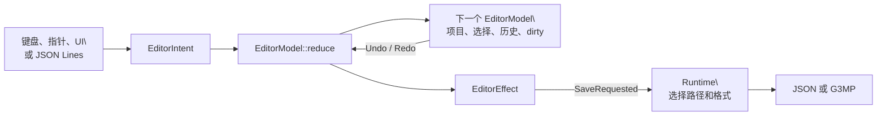

# 编辑聚合与历史

> 分类：现状；最后核对：2026-07-20。
> 依据：`map-editor-core/src/model.rs`、`virtual_command.rs`、`map-project` 的编辑历史和单元测试。

## 聚合边界

`EditorModel` 是地图编辑用例的聚合根。它同时持有 `MapProject`、可用原子图块、当前选择、工具、dirty 标记、帮助状态、状态文本、可选语义目录、编辑历史和下一个素材编号。窗口位置、文件路径、Winit 事件和 UI tree 不在聚合中。

核心入口是 `reduce(&self, EditorIntent) -> Result<(EditorModel, EditorEffect), MapError>`。调用者得到一个新 model；旧 model 不被改写。这样同一 intent 可被原生窗口、JSON Lines CLI 和测试重复执行。

## 编辑命令不是直接字段写入

画笔会把目标格的旧 `MapCell` 与新 `MapCell` 组成 `CellChange`，再执行 `MapEditCommand::ReplaceCells`。素材创建、删除和图层变更同样通过 `MapEditCommand` 进入 `EditHistory`。历史知道如何执行、撤销和重做；`EditorModel` 只负责把选择和工具解释成命令。

| 操作 | 保护规则 | 结果 |
| --- | --- | --- |
| Visual paint | 未变化的 cell 不写历史。 | 替换 visual material，保留碰撞和事件。 |
| Collision paint | 擦除回到 `Walkable`。 | 只改变 collision。 |
| Event paint | 擦除设为 `None`。 | 只改变 event。 |
| Add layer | 当前原子图块必须存在。 | 创建新的组合素材，不改旧素材。 |
| Remove layer | 组合素材至少保留一层。 | 不满足时只更新状态文本。 |
| Delete material | 任何 visual cell 引用该素材时拒绝删除。 | 删除命令可由 Undo 恢复。 |

这种分解保证编辑字段间不会互相覆盖，也让撤销不是“猜测前一帧 UI 状态”。

## 历史、dirty 与保存

状态改变的编辑命令将 `dirty` 置为 true。Undo/Redo 只在 history 真正改变项目时置 dirty；没有可撤销或重做操作时返回原项目并给出状态文本。`saved()` 只在外壳成功持久化后清除 dirty；写文件失败由外壳调用 `with_error`，不能伪造“保存成功”。

`EditorIntent::Save` 不改变项目或历史，只返回 `SaveRequested`。这个 effect 是 core 到 runtime 的端口：runtime 决定用 JSON 还是 G3MP、写到哪里、如何报告 I/O 错误。

## CLI 与 UI 的同一语义

`EditorVirtualCommand` 并非第二个编辑引擎。除 `Inspect` 和 `ValidateSemantics` 外，virtual command 解析 ID、检查 cell 和素材后，调用同一个 `reduce` 或 `reduce_many`。批量绘制只是顺序应用一组 intent。

因此远程自动化无法跳过“素材仍被使用不能删除”“未知原子图块失败”“空 cell 列表失败”等规则。新编辑功能应先增加 intent、命令和 reducer 测试，再增加鼠标、键盘或 JSON 表示。
