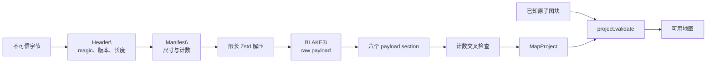

# G3MP 容器协议

> 分类：现状；最后核对：2026-07-20。
> 依据：`crates/adapter/map-project-storage/src/lib.rs` 与 storage 单元测试。

## 目标与边界

G3MP 是版本化、受大小限制的地图传输和存储容器。它不是 `MapProject` 的第二套业务模型：写入前和解码后都调用项目校验。container 只处理字节、压缩、完整性和编码，不选择路径或覆盖文件。

## 外层布局

容器由 64 字节头部、manifest 和 Zstd 压缩 payload 顺序组成：

```text
0..4    magic "G3MP"
4..6    container version (u16 little-endian)
6..8    header length (u16, 必须为 64)
8       compression (1 = Zstd)
9..12   reserved (必须为零)
12..16  manifest length (u32)
16..24  compressed payload length (u64)
24..32  raw payload length (u64)
32..64  BLAKE3(raw payload)
64..    manifest，随后是 compressed payload
```

解析先检查 magic、版本、头长、压缩码、保留位、三个长度上限和容器总长度。它在解压前拒绝畸形头部和超限输入，避免把不可信长度交给分配或解压器。

## Manifest 是可检查索引

manifest 包含自身版本、地图 `document_format`、地图 ID、tile 像素尺寸、宽高、cell 数、素材数、原子图块数、角色数、事件数和 payload schema 版本。读取时检查空标识、零 tile 尺寸、宽高与 cell 数乘积、版本和尾部消费完整性。

`inspect` 只解析头和 manifest，因此 CLI 可以在不解压完整地图时输出元数据。它仍会检查所有 manifest 基本不变量。

## Payload 的 section 协议

raw payload 以 schema 版本和 section 数量开始。当前必须存在且仅按各自编码规则解析的 section 是：

| ID | section | 内容与编码动机 |
| ---: | --- | --- |
| 1 | strings | 素材、原子图块、角色与外观的去重字符串表。 |
| 2 | materials | 组合素材和图层，以字符串表索引引用。 |
| 3 | visual | 每行选择普通索引或 RLE，较小者优先。 |
| 4 | collision | 选择 bitset 或逐行 RLE，较小者优先。 |
| 5 | events | 稀疏事件按 cell 索引增量编码。 |
| 6 | entities | 玩家出生点、角色 ID、位置、朝向和外观。 |

编码的选择针对地图数据的局部重复和稀疏性，不改变 `MapProject` 的语义。解码后还会把 manifest 的素材数、原子图块数、角色数和事件数与实际 section 结果交叉核对。

## 完整性与解码次序



读取顺序是：限制输入长度 -> 解析 header -> 解析 manifest -> 限长解压 -> 检查 raw 长度 -> 检查 BLAKE3 -> 解析 section -> 交叉检查计数 -> 构造 `MapProject` -> `project.validate(known_tiles)`。

`known_tiles` 来自调用方的资产目录，因此一个容器即使校验和正确，也不能引用当前目录未知的原子图块。完整性校验、结构校验和领域校验解决不同问题，三者不能互相代替。

写入是反向过程：先 `project.validate` 和尺寸检查，再编码、计算 raw checksum、压缩、生成 manifest 和 header。任何阶段失败返回 `MapStorageError`，没有部分写入语义；原子文件替换由 runtime/CLI 负责。
