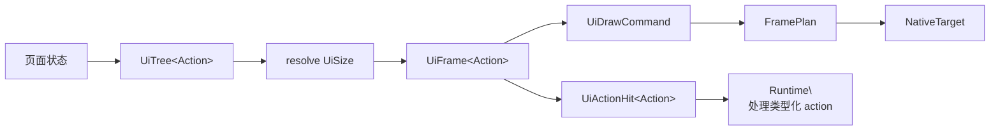

# UI 树到帧计划

> 分类：现状；最后核对：2026-07-20。
> 依据：`punctum-ui/tree.rs`、`layout.rs`、`game-ui-kit`、`game-scene-view` 与 `game-native-plan`。

## UI 是一次纯编译

Pixel UI 不在 render loop 中临时测量和点击测试。它先构建 `UiTree<Action>`，再以目标 `UiSize` 调用 `resolve`，得到同一坐标系内的 `UiFrame<Action>`：



```text
页面状态 + 类型化 action
  -> UiNode / UiTree<Action>
  -> resolve(UiSize)
  -> UiFrame<Action>
     ├─ UiDrawCommand
     ├─ UiHitRegion
     └─ UiActionHit<Action>
  -> FramePlan
```

布局、裁剪、绘制和命中一起从同一棵树导出。点击不会重新猜测 CSS/树结构，也不会由 renderer 反向决定业务 action。

## 身份与动态节点

`UiTree::new` 为 `UiNode::auto()` 确定性分配结构 ID。静态结构只靠树位置即可保持 identity；列表、标签等动态节点以 `UiKey` 标识，避免插入或排序后将旧交互状态误归属给另一个节点。

手写 `UiId`、`UiNode::legacy` 与只返回 ID 的 `hit_test` 已被标记为 deprecated。新代码应在节点上放置 `Action`，并通过 `action_hit_at`/`hit_action` 获取类型化动作。`UiId` 是布局内部索引，不是应用命令协议。

## native 编码不理解页面

`FramePlan::from_ui_frame` 只遍历通用 `UiDrawCommand`：填充和边框使用白色基础资源，图片和精灵通过内容 ID 解析到 `AssetKey`，文字转为 `NativeTextLabel`。它不知道“图鉴”“战斗”“控制台”等页面名称，也不保存 `Action`。

这条切断很重要：行为在 runtime/presentation 的输入路径中处理，视觉命令在计划层编码。一个 UI frame 可以被测试为布局和命中输出，另一个测试可以验证它是否能转为 frame plan；两者都不需要 WGPU。

## 错误与边界

tree 构建失败返回 `UiBuildError`，布局失败返回 `UiLayoutError`，资源和像素计划失败返回 `FramePlanError`。这些错误分别指出结构、几何和提交准备的责任，不能用“页面渲染失败”一个字符串混淆。

当前模型没有通用焦点管理、滚动容器、文本测量/自动换行或可访问性树。新页面可以组合已有 tree/layout/命中能力，但不能假定这些尚未提供的编译阶段存在。
