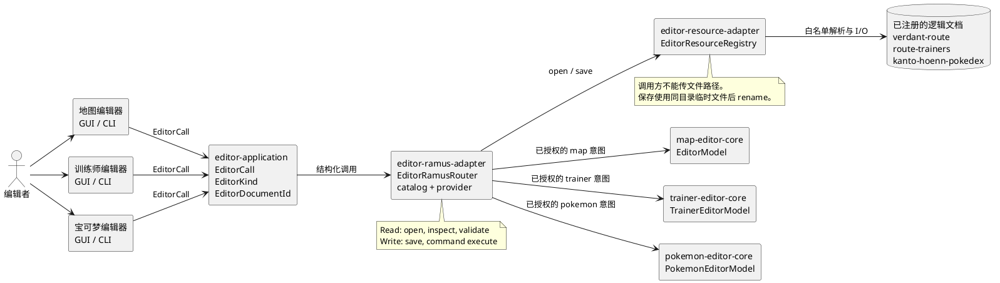

# 协议与资源

> 分类：现状；最后核对：2026-07-20。
> 依据：`editor-application`、`editor-ramus-adapter`、`editor-resource-adapter` 与 `ramus-core`。

`editor-application` 是无副作用的 Rust 协议 crate。`EditorCall` 包含版本、`EditorKind`、`EditorDocumentId`、操作和 JSON payload。当前 editor kind 为 `map`、`trainer`、`pokemon`；操作为 `inspect`、`validate`、`command`、`save`。

`EditorDocumentId` 只接受小写 ASCII、数字、连字符和下划线。JSON 反序列化立即验证这个限制，因此 `../`、绝对路径和空 ID 不能进入协议。读操作不能带 payload；业务命令仍由各 editor core 的 serde enum 和构造器校验。

## 组件关系

下图只描述当前已经实现的输入、授权、纯状态与文件 I/O 边界。GUI 和 JSON Lines CLI 都不直接访问资源文件；它们先构造 `EditorCall`，再交给 Ramus 路由。

`EditorRamusRouter` 负责 catalog、capability、schema 和 provider；它不保留编辑状态，也不读写文件。三个 core 只负责各自的状态与业务校验。`EditorResourceRegistry` 是唯一将 `(EditorKind, EditorDocumentId)` 解析为文件位置并执行 I/O 的实现。

`ramus-core::ValueType` 已支持 `List` 与 `Record`。`editor-ramus-adapter` 使用这些结构类型注册下列能力，并在 provider 中再还原为 `EditorCall`：

| Ramus 路径与方法 | effect | 结果 |
| --- | --- | --- |
| `/editor/resource open` | `Read` | 请求 runtime 装载一个逻辑文档。 |
| `/editor/resource inspect` | `Read` | 路由为 `EditorOperation::Inspect`。 |
| `/editor/resource validate` | `Read` | 路由为 `EditorOperation::Validate`。 |
| `/editor/resource save` | `Write` | 路由为 `EditorOperation::Save`。 |
| `/editor/command execute` | `Write` | 接受 record payload，路由为 `EditorOperation::Command`。 |

路由器创建 `editor-client` principal，并为已注册方法发放 `Discover`、`Complete` 和相应 read/write capability。它不读文件，也不持有编辑状态。人类 DSL 和结构化 `EditorCall` 都经过同一 catalog、授权、schema、provider 和 runtime 执行链。

`editor-resource-adapter` 使用 `(EditorKind, EditorDocumentId)` 白名单解析内容位置。当前注册表为 `verdant-route`、`route-trainers` 和 `kanto-hoenn-pokedex`。调用方不传文件路径；注册表拒绝绝对路径和父目录片段。保存先写同目录临时文件，再 rename 到已经注册的位置。

资源 adapter 是副作用边界。editor core 只生成状态、诊断和保存请求；Ramus 只授权和路由；runtime 决定何时调用 adapter。
