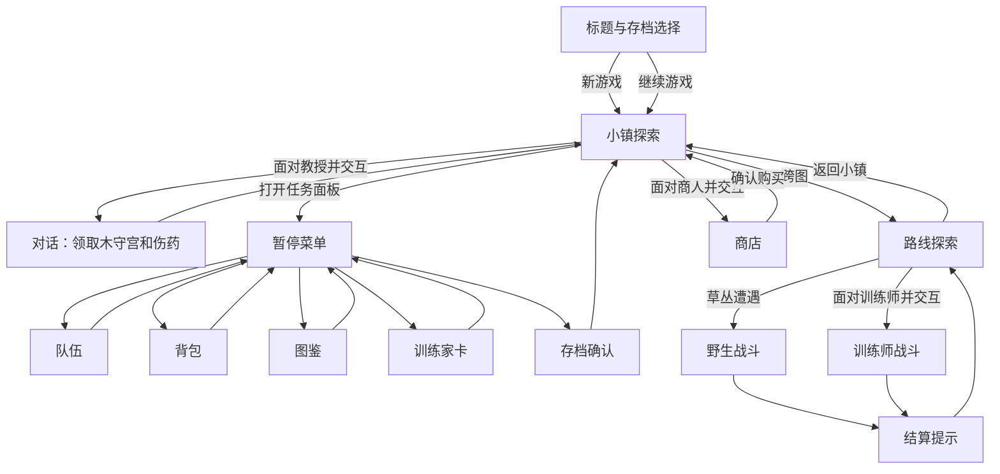

# 玩家页面与导航合同

> 分类：未来；起草：2026-07-22。
> 状态：产品与表现层提案。本文定义玩家页面、story、跳转和参数边界，不表示所有页面已经实现。

## 结论

终态 UI 分成两类。

1. 地图与战斗是独占场景。它们占用主画布，输入直接服务于探索或对战。
2. 背包、队伍、图鉴、商店、训练家卡与存档是任务面板。它们覆盖在场景上，只改变表现层路由和焦点，不拥有游戏事实。

页面跳转只传递稳定 ID、选中项、数量和返回目标。位置、队伍、金钱、背包、训练师完成状态、合法对战动作和存档可用性一律从 `ProductSnapshot` 读取。页面关闭、重建或换平台不能改变游戏状态。

## 终态玩家 story

首个区域使用当前 `ThinSliceContent::standard()` 的小镇和路线作为完整演示，不将它误写成最终内容规模。



玩家在这个 story 中应始终能回答四个问题：现在在哪里、接下来可以做什么、这次行动改变了什么、能否安全保存。页面负责说明这些问题；`ProductSession` 负责判断动作是否成立。

## 页面清单

| 页面 | 类型 | 进入条件 | 主数据源 | 离开方式 | 当前依据 |
| --- | --- | --- | --- | --- | --- |
| 标题与存档选择 | 独占页面 | 启动完成内容包校验 | 存档槽摘要、内容版本 | 新游戏、继续、退出 | 未来。当前 runtime 直接创建 `ProductSession`。 |
| 新游戏确认 | 对话框 | 标题页选择新游戏 | 内容包的起始区域摘要 | 确认创建、返回标题 | `ProductCommand::NewGame` 已存在。 |
| 世界探索 | 独占场景 | 新游戏或读档成功；战斗结束 | `ProductSnapshot::state`、世界投影、可见 NPC | 打开暂停、交互、warp、遭遇 | `ProductSession`、`game-host` 已有产品入口。 |
| 对话与事件提示 | 覆盖层 | 互动、奖励、warp、规则拒绝或战斗结算 | 类型化 `ProductEvent`、内容文本 ID | 翻页、确认、关闭 | 事件已有；通用对白路由尚未形成。 |
| 暂停菜单 | 覆盖层 | 世界探索时打开 | `ProductSnapshot` 摘要 | 选子页、关闭回世界 | 未来。当前基础页以 `Journey` 承担临时入口。 |
| 队伍 | 任务面板 | 暂停菜单或战斗换人 | `GameState::party`；战斗中另读合法替换动作 | 选择成员、返回 | 当前基础页只显示队伍行；战斗已有换人菜单。 |
| 背包 | 任务面板 | 暂停菜单 | `GameState::inventory`、物品定义、金钱 | 选物品、返回 | 当前基础页已有列表；场景外使用道具尚未定义。 |
| 图鉴 | 任务面板 | 暂停菜单 | `PokedexData`、表现资源 | 选条目、返回 | 当前已可独立打开和浏览；选择参数仍是索引。 |
| 训练家卡 | 任务面板 | 暂停菜单 | 队伍、金钱、flag、已击败训练师 | 返回 | 当前基础页已投影。 |
| 商店 | 任务面板 | 面对商人并交互 | `ShopId`、`ShopDefinition`、背包、金钱 | 购买确认、关闭回世界 | `MerchantOpened` 与购买命令已存在；专用商店页尚未形成。 |
| 对战主菜单 | 独占场景内的决策区 | 存在活动 `ProductBattleSnapshot` | 只读 battle observation、合法动作 | 选招式、换人、背包、逃跑 | `game-ui::BattleUiState` 已有主菜单。 |
| 招式与换人 | 对战子页 | 对战主菜单选择；强制换人 | 合法 `Action` 集、对战观察 | 提交动作或返回主菜单 | 招式/换人已有；背包尚未接入正式对战。 |
| 对战结算 | 覆盖层 | 回放结束并完成原子回写 | `BattleResultPatch`、`FoundationEvent` | 确认回世界 | 结果事件已存在；结算页面尚未形成。 |
| 存档确认与反馈 | 对话框 | 世界安全点且 `save_available` 为真 | 存档槽、内容/规则版本、`save_available` | 确认保存或取消 | `ProductSession::save` 已拒绝战斗中保存；槽位 UI 尚未形成。 |

图鉴、背包、商店和队伍不是“次要游戏界面”。它们需要支持列表扫描、类别切换、数值比较、禁用原因和明确反馈。视觉语言可以比地图和战斗更工具化，但仍应复用统一的色彩、焦点和状态 token。

## 现状与目标的分界

当前产品入口已用 `ProductSession` 取代第二份长期状态，并以 `ProductSnapshot` 投影基础页。现有 `FoundationPage` 只有 `Journey`、`Bag`、`TrainerCard`；图鉴由 `PresentationState` 单独控制；商店只通过“购买伤药”操作触发。它们是可运行证据，不是终态信息架构。

以下能力必须在页面设计中保留，而不能被 UI 重算：

- 活动战斗期间 `ProductSnapshot::save_available()` 为假，保存入口必须显示不可用原因。
- 战斗动作来自 `ProductSession::legal_player_actions()`。页面不能根据文字或按钮位置猜测合法性。
- 商店价格与背包容量来自 `ShopDefinition`、`Inventory` 与 `Money`。购买确认只提交 `ItemId` 和数量。
- `BattleResultPatch` 成功应用后，长期队伍、经验、金钱与训练师完成状态才可显示为已更新。
- 存档加载必须校验内容包与规则包引用。标题页不能把不兼容存档伪装成可继续。

## 路由模型

路由属于 presentation。下列枚举是目标形状，用于固定页面边界；名称不要求在同一 crate 中实现。

```text
PlayerRoute
  = Title(TitleRoute)
  | World(WorldRoute)
  | Overlay(OverlayRoute)
  | Battle(BattleRoute)

TitleRoute
  = SaveSelect { selected_slot: SaveSlotId }
  | NewGameConfirm { slot: SaveSlotId }

WorldRoute
  = Explore

OverlayRoute
  = Dialogue { source: DialogueSource, page: u16, return_to: World }
  | Pause { page: PausePage }
  | Shop { shop: ShopId, selected_item: Option<ItemId>, quantity: u16, return_to: World }
  | BattleResult { battle: BattleId, outcome: BattleOutcome, return_to: World }
  | SaveConfirm { slot: SaveSlotId, return_to: World }

PausePage
  = Menu
  | Party { selected: Option<CreatureId> }
  | Bag { category: Option<ItemCategory>, selected: Option<ItemId> }
  | Pokedex { selected: NationalDexNo }
  | TrainerCard

BattleRoute
  = Main
  | Moves { selected: MoveSlot }
  | Party { selected: TeamSlot, forced: bool }
  | Item { selected: Option<ItemId> }
```

`SaveSlotId` 和 `NationalDexNo` 是未来表现层值对象。当前存档路径尚未有多槽 ID；当前图鉴以 `selected_index: usize` 工作。页面实现前应先将它们收敛为稳定、可显示、可测试的值，而不是把文件路径或列表下标扩散到动作合同。

`return_to` 只能表达恢复哪个 UI 场景，不能保存一份 `GameState`、`BattleSession` 或窗口对象。关闭覆盖层后，统一从最新 `ProductSnapshot` 重建世界或对战画面。

## 页面 demo 与渲染无关边界

每个可进入的 `PlayerRoute` 都必须先有一个 `PageDemo`，再允许接入原生二进制。demo 不是截图、线框图或手工摆出的假 UI；它是一个可在无窗口测试中运行的、确定的页面场景：给定产品快照、路由、本地交互状态和类型化输入，得到同一个页面模型与同一组可执行 action。

```text
PageDemo
  = PageDemoId
  + initial ProductSnapshot fixture
  + PlayerRoute
  + page-local selection/focus state
  + typed PageIntent sequence
  + expected PageModel and PageEffect

PageModel --project--> UiTree<PageAction> --resolve(UiSize)--> UiFrame<PageAction>
UiFrame  --adapter--> WGPU FramePlan | terminal cell plan | screenshot fixture
```

其中 `PageDemoId` 是稳定值，例如 `world-pause-menu`、`shop-potion-preview`、`battle-forced-switch`。它既用于开发者选择 demo，也用于目录覆盖测试；不得以 Rust 测试名、窗口标题或资源路径充当 ID。

`game-page-model` 已提供一个不依赖 `winit`、`wgpu`、文件系统或时钟的纯页面模型 crate。它只依赖产品快照、稳定领域 ID 与类型化应用命令，拥有下列边界：

| 层 | 职责 | 禁止依赖或持有 |
| --- | --- | --- |
| `game-page-model` | `PlayerRoute`、页面局部选择/焦点、`PageIntent`、`PageModel`、`PageEffect`、`PageDemo` 与 demo 目录 | 窗口、GPU、原始按键、资源路径、`GameState` 副本、`BattleSession`。 |
| `game-view` | 将 `PageModel` 投影为 `UiTree<PageAction>`；使用语义化文本和资源 key | `FramePlan`、原生窗口、产品命令执行。当前仍有 `punctum-gpu` 类型依赖，迁移时需要单独清理，不应把它误称为已完全纯净。 |
| `punctum-wgpu`、`punctum-crossterm` | 将已 resolve 的 `UiFrame` 翻译为各自的帧计划或终端单元 | 路由规则、页面 fixture、购买或战斗判断。 |
| `game-page-demo` 二进制 | 组合选定 `PageDemo`；把原始点击转为 `PageIntent`；调用 renderer | 地图初始化、页面布局细节、页面 fixture、产品命令执行、存档写入。 |

`PageIntent` 表示用户意图而不是设备事件，例如 `OpenPause`、`SelectItem(ItemId)`、`SetQuantity(u16)`、`ConfirmPurchase`、`RequestSave`、`SubmitBattleAction` 与 `Close`。页面 reducer 只能产生 `PageEffect::Navigate(...)` 或 `PageEffect::SubmitProduct(ProductCommand)` 等请求；真正执行 `ProductCommand`、取得新 `ProductSnapshot` 的责任仍在应用层。这样 demo 既可以用静态 fixture，也可以只通过真实产品命令构造“购买后”“战斗结束后”等快照，不需要为了演示复制一套业务规则。

`game-page-demo` 以 `--page-demo <PageDemoId>` 选择已登记场景，默认打开 `world-starting-town`。ops 只接受目录中的受限 ID；二进制也会再次验证。它是便利壳，不是 demo 的运行前提。页面先通过无窗口测试，再由该壳在 WGPU renderer 中人工检查。购买和存档在壳中只显示“请求已发出”的反馈，绝不写入产品状态或文件。页面的模型、交互和通过条件不能藏在 binary 的事件循环中。

## Demo 目录与门槛

终态 `PageDemoCatalog` 必须一对一覆盖本文件的页面清单；新增页面时，若没有 demo，目录测试必须失败。一个页面可以有多个 demo 来覆盖关键状态，但至少有一个主场景。下表是终态目录，不表示全部已经实现。

当前已登记 8 个 demo：`world-starting-town`、`world-pause-menu`、`party-single-member`、`bag-potion-list`、`pokedex-seen-and-unseen`、`trainer-card-starting-town`、`shop-potion-preview` 和 `save-confirm-available`。当前 catalog 测试只要求覆盖已实现的 `PlayerPage` 枚举值；标题、新游戏、对话和对战页面进入代码时，必须同时扩展枚举、目录和测试。

| 页面 | 必需 demo | 最少覆盖状态 |
| --- | --- | --- |
| 标题与存档选择 | `title-empty-and-compatible-slot` | 空槽、兼容槽、不可继续槽。 |
| 新游戏确认 | `new-game-confirm` | 确认与返回。 |
| 世界探索 | `world-starting-town` | 小镇 HUD、菜单入口、教授互动前后。 |
| 对话与事件提示 | `dialogue-professor-gift` | 多页推进、奖励后刷新。 |
| 暂停菜单 | `world-pause-menu` | 四个入口与返回世界。 |
| 队伍 | `party-single-member` | 选中成员、可读 HP/状态、返回。 |
| 背包 | `bag-potion-list` | 空/有物品、选中项、禁用原因。 |
| 图鉴 | `pokedex-seen-and-unseen` | 已见、未见、稳定编号选择。 |
| 训练家卡 | `trainer-card-starting-town` | 队伍、金钱和进度摘要。 |
| 商店 | `shop-potion-preview` | 余额、数量、容量、购买请求与拒绝原因。 |
| 对战主菜单 | `battle-main-menu` | 合法动作、播放锁定。 |
| 招式与换人 | `battle-moves-and-forced-switch` | 普通返回与强制换人不可返回。 |
| 对战结算 | `battle-result-patch-applied` | 结算前后快照差异、返回世界。 |
| 存档确认与反馈 | `save-confirm-available` | 可保存和请求反馈。 |

目录中的 fixture 应优先复用 `ThinSliceContent::standard()` 的小镇、路线、教授、商人与两场战斗。当前 `party-single-member`、`bag-potion-list`、`pokedex-seen-and-unseen` 和 `trainer-card-starting-town` 都通过“向上转向后互动教授”的真实 `ProductCommand` 序列取得赠礼快照。图鉴的“已知”目前只从当前队伍拥有的物种推导，不代表完整的图鉴发现进度。需要多成员队伍或多槽不兼容存档的页面，可以增加最小专用 fixture；禁止为了页面 demo 在 renderer 或 binary 中伪造金钱、队伍、价格和战斗结论。

每个 demo 至少有三类断言：

1. reducer：给定 `PageIntent` 后的路由、selection 与 `PageEffect` 正确，且不会直接改写业务事实。
2. projection：`PageModel` 投影出的 `UiTree` 在 `960x720`、`640x480`、`320x240` 三个逻辑尺寸都能 resolve，并暴露预期的类型化 action、禁用状态和关键文本/资源 key。
3. catalog：每个 `PlayerPage` 枚举值都有至少一个 `PageDemoId`，没有重复或失效入口。

这些测试证明“页面本身”可独立于 renderer 运行。原生截图、真实键盘、字体、缩放和命中区域仍需通过 binary 壳做最终验收；它们不能替代纯 demo 测试，也不能反过来把页面状态塞回 binary。

## 跳转与参数合同

| 从 | 到 | 触发 | 跳转参数 | 业务命令或事件 | 禁止传递 |
| --- | --- | --- | --- | --- | --- |
| 标题 | 新游戏确认 | 选择空槽 | `SaveSlotId` | 无 | 初始 `GameState`、窗口对象。 |
| 新游戏确认 | 世界探索 | 确认 | 无 | `ProductCommand::NewGame` | 临时队伍副本。 |
| 标题 | 世界探索 | 选择兼容存档 | `SaveSlotId` | load adapter -> `ProductSession::from_save` | 未校验的 JSON。 |
| 世界探索 | 暂停菜单 | 菜单键 | `PausePage::Menu` | 无 | 世界状态副本。 |
| 暂停菜单 | 队伍 | 选择“队伍” | `selected: Option<CreatureId>` | 无 | 成员 HP/PP 副本。 |
| 暂停菜单 | 背包 | 选择“背包” | 分类与 `Option<ItemId>` | 无 | 金钱、物品数量副本。 |
| 暂停菜单 | 图鉴 | 选择“图鉴” | `NationalDexNo` | 无 | `PokedexData` 可变引用。 |
| 暂停子页 | 暂停菜单 | 返回 | 无 | 无 | 世界状态副本。 |
| 暂停菜单 | 世界探索 | 返回 | 无 | 无 | 世界状态副本。 |
| 世界探索 | 对话 | 互动或事件 | `DialogueSource`、页码、返回世界 | `ProductEvent::Foundation(...)` | 事件执行器或 flag 可变引用。 |
| 世界探索 | 商店 | `MerchantOpened { shop }` | `ShopId`、选中物品、数量、返回世界 | `ProductEvent::Foundation(...)` | 价格、余额的手工副本。 |
| 商店 | 商店 | 改数量 | 同一 `ShopId`、`ItemId`、数量 | 无 | 已扣款的本地预览状态。 |
| 商店 | 世界探索 | 确认购买或关闭 | 返回世界 | `ProductCommand::BuyFromFront` 或 `Buy` | 商店的可变库存；当前合同无店铺库存。 |
| 世界探索 | 对战主菜单 | `BattleStarted` | `BattleRoute::Main` | `ProductEvent::BattleStarted` | 人工构造的对手队伍。 |
| 对战主菜单 | 招式/换人 | 选择命令 | `MoveSlot` 或 `TeamSlot`、强制换人标记 | 无 | `Action` 的未验证副本。 |
| 对战子页 | 对战主菜单或回放 | 提交合法动作 | 当前 `BattleRoute` | `ProductCommand::SubmitBattleAction` | 伤害、胜负、奖励。 |
| 对战 | 结算 | `BattleResolved` | `BattleId`、`BattleOutcome`、返回世界 | `ProductEvent::BattleResolved` | 可变 `BattleResultPatch`。 |
| 世界探索 | 存档确认 | 选择保存 | `SaveSlotId`、返回世界 | 无 | `SaveEnvelope` 的可变状态。 |
| 存档确认 | 世界探索 | 确认或取消 | 返回世界 | `ProductSession::save` -> adapter 写盘 | 文件句柄、未验证存档。 |

商店的当前命令以“前方商人”简化定位，但终态商店页必须保留 `ShopId`。这样一旦多个商人、远程商店、任务商店或剧情折扣进入内容包，页面和命令仍能明确指出价格表来源。

## 输入、焦点与返回规则

所有页面都使用类型化 action。UI tree 通过 `UiNode::auto()` 建立结构身份，动态列表通过 `UiKey` 固定身份；命中测试返回 action，不返回裸 `UiId`。

| 场景 | 主输入 | 返回规则 | 焦点规则 |
| --- | --- | --- | --- |
| 世界探索 | 方向、交互、菜单 | 无覆盖层时不拦截 | 地图不保留菜单焦点。 |
| 暂停与信息面板 | 方向、确认、返回 | 返回上一级；根菜单返回世界 | 关闭后保留最后一个 `PausePage`，但不缓存业务数据。 |
| 商店 | 方向、数量调整、确认、返回 | 返回世界；购买后留在商店并刷新快照 | 保留 `ShopId` 与 `ItemId`；数量在条目变更时归一化。 |
| 对战 | 方向、确认、返回 | 非强制换人可返回主菜单；强制换人不可返回 | 焦点必须指向当前合法动作，播放锁定时不接受新动作。 |
| 存档确认 | 确认、取消 | 取消回调用来源 | 保存失败停留在确认页并显示类型化原因。 |

当前通用焦点导航、滚动容器和文本自动换行尚未成为 `punctum-ui` 的通用合同。首批页面需在已有布局能力内实现局部行为；若要复用滚动、虚拟列表或跨页面焦点恢复，应先把它们设计为 UI 框架能力，而不是在每页复制。

## 设计优先级

### P0：让垂直切片完整可读

1. 标题与存档选择。
2. 世界 HUD、暂停菜单、队伍、背包、商店与保存确认。
3. 战斗主菜单、招式、换人与结算。
4. 对话与规则失败提示。

这组页面覆盖新游戏、赠送、遭遇、训练师、购买、保存和加载。图鉴可以与 P0 并行改造，但不能阻塞安全点存档和战斗结算。

### P1：让密集信息可操作

1. 背包类别、物品详情和场景外使用合同。
2. 图鉴检索、已见/已捕获状态与稳定图鉴编号。
3. 商店多条目、数量步进、余额与容量预览。
4. 队伍成员详情、多成员编队与战斗换人。

### P2：在内容规模扩大后再做

地图、任务日志、图鉴筛选器、商店库存、折扣、经济历史、可恢复战斗、设置和无障碍选项。它们必须在对应的状态和内容合同存在后进入 UI；不能只为页面完整感预建假的数据模型。

## 完成定义

该页面合同进入实现前，至少需要满足：

1. 每条 P0 跳转都有单一触发事件或类型化用户 action。
2. 每个页面参数都能在一个小表中说明来源、生命周期和返回目标。
3. 不存在以页面状态保存 HP、金钱、奖励、flag 或战斗结论的路径。
4. 安全点、战斗锁定、非法购买和不兼容存档都有可见且可操作的反馈。
5. 通过键盘完成小镇 -> 路线 -> 两场战斗 -> 商店 -> 存档 -> 加载时，焦点不会丢失或进入没有合法动作的页面。
6. 页面清单中的每个 `PlayerPage` 都在 `PageDemoCatalog` 中有稳定 `PageDemoId`；遗漏或重复必须由测试失败拦住。
7. 每个 demo 都先通过 reducer、三种逻辑尺寸的 `UiTree` resolve 和类型化 action 断言，才能接入原生 binary。
8. binary 只组合 session/demo、输入适配和 renderer；页面模型、fixture、布局规则和业务判断不允许回流到 binary。

实现时还需要用 `ops` 验证表现层单元测试、文档检查与 Windows 原生输入。无窗口测试不能证明文本、焦点、缩放和命中区域在实际窗口中可用。
